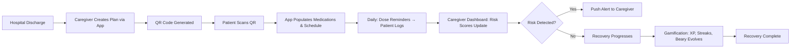
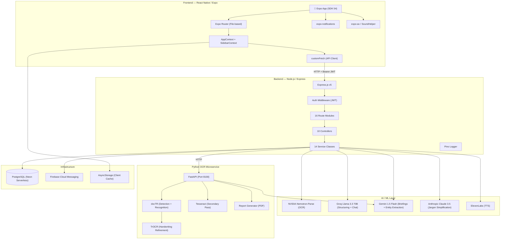
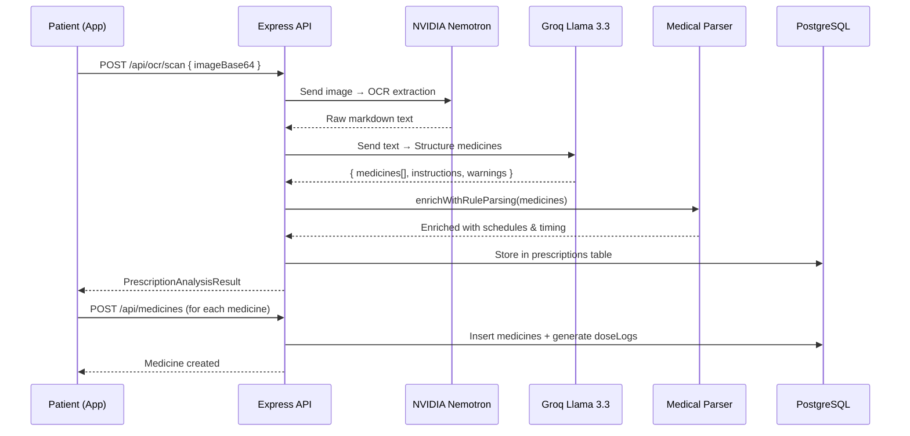
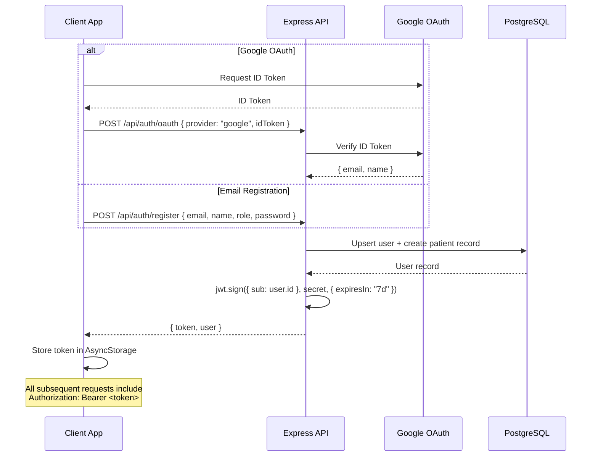
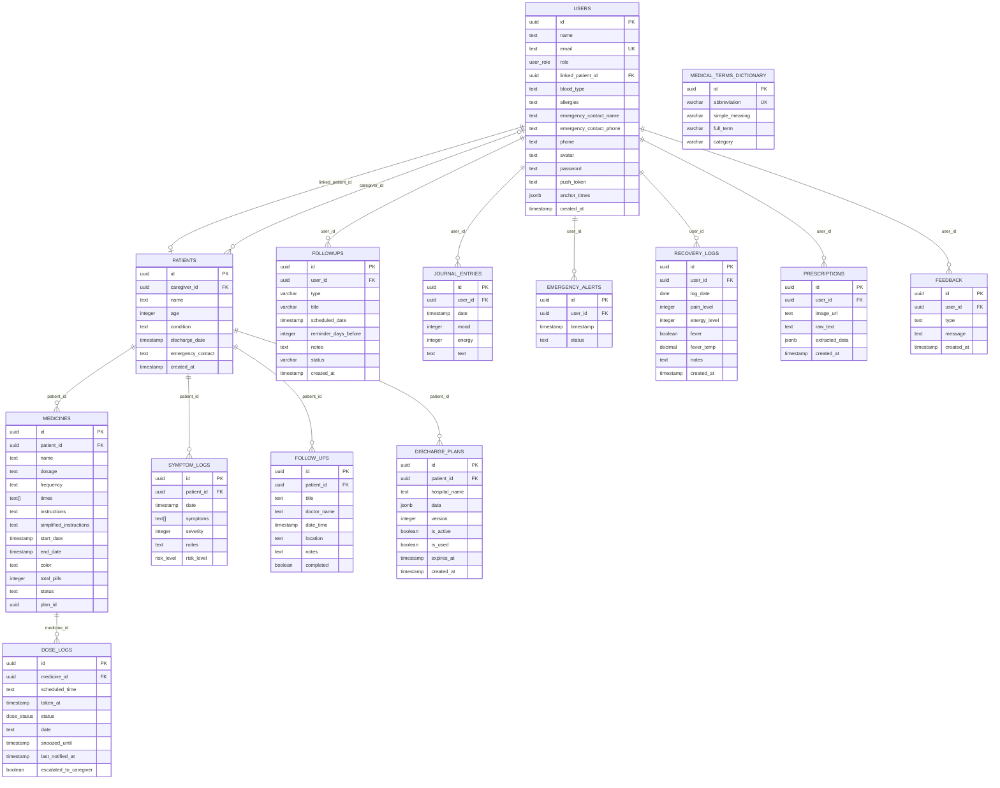
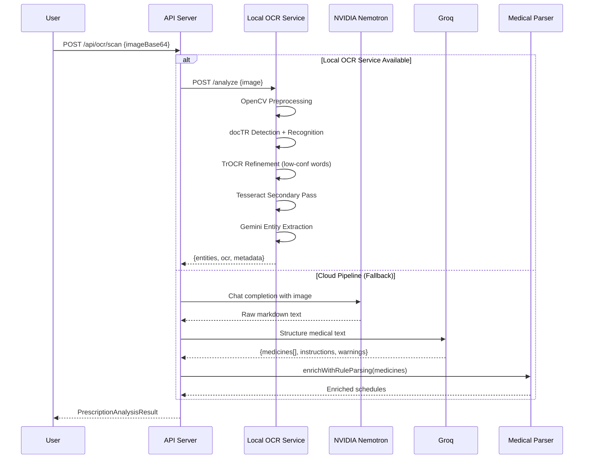

# 🏥 IMPLEMENTATION.md — Discharge Buddy

> **Revision**: June 2026  
> **Purpose**: Complete reverse-engineered technical documentation for developers, AI assistants, judges, and future contributors.

---

# 1. Executive Summary

## What Is Discharge Buddy?

**Discharge Buddy** is a full-stack, AI-powered post-hospital recovery platform built for the **Google Solution Challenge 2026**. It bridges the critical "last mile" gap between hospital discharge and full patient recovery — a period responsible for millions of preventable readmissions annually.

## The Real-World Problem

When patients leave a hospital, they receive handwritten prescriptions, complex discharge instructions laden with medical jargon, and a confusing schedule of follow-ups — all while physically and mentally vulnerable. Studies show:

- **50%** of patients misunderstand their discharge instructions.
- **25%** of hospital readmissions within 30 days are preventable.
- Medication non-adherence costs the U.S. healthcare system **$290 billion/year**.

## The Solution

Discharge Buddy transforms this chaotic handoff into a structured, gamified, and AI-monitored recovery journey:

1. **Digitizes prescriptions** using a multi-model OCR + LLM ensemble (NVIDIA Nemotron, docTR, TrOCR, Groq Llama 3.3).
2. **Automates medication scheduling** with morning/afternoon/night dose tracking.
3. **Monitors patient risk** using a real-time scoring engine for caregivers.
4. **Simplifies medical jargon** using Claude 3.5 Sonnet for plain-language translation.
5. **Gamifies recovery** with a mascot ("Beary"), XP, streaks, and success animations.
6. **Enables emergency SOS** with one-tap alerts and a digital medical card.

## Target Users

| User Type | Description |
| :--- | :--- |
| **Patients** | Post-surgery or chronic illness patients managing medications at home. |
| **Family Members** | Remote caregivers who need real-time peace of mind about a loved one. |
| **Healthcare Staff** | Nurses, doctors, and hospital staff creating discharge plans and monitoring adherence. |

## Core Value Proposition

A single platform that turns a paper prescription into an automated, AI-monitored, gamified recovery plan — with real-time alerts for the entire care circle.

---

# 2. Product Vision

## Long-Term Vision

To become the **universal standard for post-discharge patient management** — a platform that every hospital adopts, every patient trusts, and every caregiver relies on. The vision extends to integrating telemedicine, drug interaction alerts, and predictive relapse detection.

## Expected User Journey



## How Users Interact

1. **Onboarding**: Role selection → Registration (Patient / Family / Caregiver).
2. **Plan Import**: Scan a QR code from the hospital OR take a photo of a prescription.
3. **Daily Use**: View dashboard → Take doses → Log symptoms → Chat with AI assistant.
4. **Monitoring**: Caregivers view a risk-scored patient list, receive push alerts, and listen to AI shift briefings.

## Intended Impact

- **Reduce hospital readmissions** by ensuring medication adherence.
- **Reduce caregiver anxiety** with real-time monitoring.
- **Democratize health literacy** by translating medical jargon to plain language.
- **Empower patients** through gamification and emotional feedback loops.

---

# 3. Complete Feature Inventory

## 3.1 Authentication & User Management

### Registration & Login
- **Purpose**: Multi-role account creation (Patient, Family, Caregiver) with email/password and Google OAuth.
- **User Flow**: Onboarding → Role Select → Register (email + password + optional family member linking) → Dashboard.
- **Components**: `onboarding.tsx`, `login.tsx`, `register.tsx`, `role-select.tsx`.
- **Backend**: `routes/auth.ts` — handles `/auth/register`, `/auth/login`, `/auth/oauth`.
- **Database**: `users` table with role enum (`patient`, `caregiver`, `family`), `patients` table auto-created on registration.
- **Auth Mechanism**: JWT tokens (7-day expiry), stored client-side in AsyncStorage, attached via `setAuthTokenGetter` in `customFetch`.

### Profile Management
- **Purpose**: Edit personal info, medical details (blood type, allergies, emergency contacts).
- **Components**: `profile.tsx`, `profile/edit.tsx`, `profile/change-password.tsx`.
- **Backend**: `PUT /api/auth/profile`, `POST /api/auth/change-password`.
- **Database**: Updates the `users` table.

### Dev Session
- **Purpose**: One-click dev login that seeds a test user with sample medications and dose logs.
- **Backend**: `GET /api/auth/dev-session` (disabled in production via `NODE_ENV` check).
- **Security Note**: ⚠️ Only blocked by a `NODE_ENV` string check — no cryptographic protection.

---

## 3.2 OCR & Prescription Parsing

### Smart Prescription Scanner
- **Purpose**: Digitize handwritten or printed prescriptions into structured medication data with 98% claimed accuracy.
- **User Flow**: Tap Scan → Capture image → Processing animation → Review extracted medicines → Confirm & add to schedule.
- **Components**: `scan.tsx` (camera + image picker), `MedicineCard.tsx` (review UI).
- **Backend**: `POST /api/ocr/scan` → `PrescriptionService.analyzePrescription()`.
- **AI Pipeline** (see §9 for full details):
  1. **NVIDIA Nemotron-Parse**: Raw OCR extraction from image.
  2. **Groq Llama 3.3 70B**: Structures raw text into `{medicines[], instructions, warnings}`.
  3. **Medical Parser**: Rule-based enrichment (frequency codes → schedules, timing abbreviations).
- **Fallback Chain**: Local OCR Service (Python) → NVIDIA + Groq → Error with user guidance.
- **Database**: Results stored in `prescriptions` table (image URL, raw text, extracted JSON).

### Local OCR Microservice (Python)
- **Purpose**: Alternative OCR pipeline using local ML models for environments where cloud APIs are unavailable.
- **Components**: `ocr-service/main.py`, `ocr_engine.py`, `preprocessing.py`, `quality_check.py`.
- **Pipeline**: Image → OpenCV preprocessing → docTR (layout + text detection) → TrOCR (handwriting refinement) → Tesseract (secondary pass) → Gemini entity extraction.
- **Models Used**: `db_resnet50` (detection), `crnn_vgg16_bn` (recognition), `microsoft/trocr-base-handwritten` (refinement).
- **API**: FastAPI on port 8100 (`POST /analyze`, `GET /health`).

---

## 3.3 Medication Scheduling

### Automated Medicine Schedule
- **Purpose**: Convert raw frequency codes (OD, BD, TDS, QID, 1-0-1) into timed dose slots using patient-configurable anchor times.
- **User Flow**: Medicines added (via scan or manual) → System generates daily dose logs → Dashboard shows upcoming/overdue doses.
- **Components**: `(tabs)/medicines.tsx`, `(tabs)/schedule.tsx`, `MedicineCard.tsx`, `TimeOfDayFilter.tsx`.
- **Backend**: `MedicineService.generateDosesForToday()` — auto-creates `doseLogs` entries for each scheduled time.
- **Database**: `medicines` (name, dosage, frequency, times[], startDate, endDate), `doseLogs` (per-day, per-time status tracking).
- **Anchor Times**: Stored in `users.anchorTimes` as `{morning: "08:00", afternoon: "14:00", evening: "20:00", night: "22:00"}`. Used by `DischargeService.normalizePlan()` to map clinical frequencies to exact clock times.

### Dose Tracking & Adherence
- **Purpose**: Log doses as taken/missed/snoozed and calculate adherence metrics.
- **User Flow**: View today's doses → Swipe to mark taken → Animation + sound feedback → Adherence ring updates.
- **Components**: `AdherenceRing.tsx`, `LiquidCapsuleProgress.tsx`, `DayNightToggle.tsx`.
- **Backend**: `PUT /api/medicines/doses/:id/status` → `MedicineService.updateDoseStatus()`.
- **Auto-miss**: `DoseTrackingService.markMissedDoses()` marks pending doses older than 2 hours as `missed`.
- **Database**: `doseLogs.status` enum: `pending` → `taken` / `missed` / `snoozed`.

---

## 3.4 Caregiver Monitoring

### Caregiver Dashboard
- **Purpose**: Real-time patient monitoring with AI-computed risk scores and color-coded risk gauges.
- **User Flow**: Login as Caregiver → View patient list → See risk levels (Low/Moderate/High) → Tap patient for details → Listen to AI briefing.
- **Components**: `caregiver/dashboard.tsx`, `caregiver/patient-detail.tsx`, `caregiver/alert.tsx`, `caregiver/monitor.tsx`, `caregiver/remind.tsx`, `caregiver/message.tsx`.
- **Backend**: `GET /api/caregiver/patients` — returns patients with nested medicines, doseLogs, symptomLogs, followUps, riskScore, riskLevel.
- **Risk Scoring Engine** (computed in `routes/caregiver.ts`):
  - Base score: 10
  - +15 per missed/overdue dose
  - +30 for severe pain (severity ≥ 8 or riskLevel = "high")
  - +40 for fever with severity ≥ 7
  - +25 for inactivity > 48 hours
  - Capped at 100. Levels: >70 = High, >35 = Moderate, ≤35 = Low.
- **Silent Patient Detection**: If a patient has overdue doses AND no symptom log for > threshold hours (6h for family, 48h for staff), an inactivity push notification is sent.

### Discharge Plan Creation (QR Handover)
- **Purpose**: Caregivers create structured discharge plans that patients import via QR code scan.
- **User Flow**: Caregiver fills form (patient info + medications + instructions) → Plan saved → QR code generated with `planId` → Patient scans QR → App imports plan.
- **Components**: `caregiver/create-plan.tsx`, `scan-qr.tsx`.
- **Backend**:
  - `POST /api/caregiver/create-plan` → Creates patient record + `dischargePlans` entry.
  - `POST /api/discharge/import` → `DischargeService.importPlan()` — validates plan, normalizes meds, batch-inserts medicines + dose logs.
- **Versioning**: Plans have a `version` field, auto-incremented. `isUsed` flag prevents double-import. 24-hour expiry.
- **Database**: `dischargePlans` (patientId, hospitalName, data JSON, version, isActive, isUsed, expiresAt).

### AI Shift Briefing
- **Purpose**: AI-generated 2-sentence clinical summary of a patient's last 48 hours for busy medical staff.
- **Backend**: `GET /api/caregiver/briefing/:patientId` → Gemini 1.5 Flash generates a concise summary from dose logs and symptom data.
- **Playback**: Rendered via `expo-speech` in the frontend.

---

## 3.5 Family Management

### Family Dashboard
- **Purpose**: Family members can monitor linked patients, book appointments, and manage members.
- **Components**: `family/dashboard.tsx`, `family/book-appointment.tsx`.
- **Backend**: `GET /api/family/members`, `POST /api/family/members`, `POST /api/family/members/link`.
- **Database**: Family users have `role = "family"` and link to patients via `patients.caregiverId`.

---

## 3.6 Notifications

### Push Notification System
- **Purpose**: Server-side push notifications via Firebase Cloud Messaging (FCM) for dose reminders, missed dose alerts, and emergency escalations.
- **Backend**: `NotificationService` in `services/notificationService.ts` — uses `firebase-admin` SDK.
- **Notification Types**:
  - `PLAN_IMPORTED`: Sent to caregiver when patient imports a discharge plan.
  - `DOSE_TAKEN`: Sent to caregiver when patient takes a dose.
  - `INACTIVITY_ALERT`: Sent to caregiver when patient is "silent" for too long.
- **Client-Side**: `expo-notifications` for local scheduling, `NotificationHelper.ts` for permission handling and token registration.
- **Token Flow**: Client gets push token → `POST /api/auth/push-token` → Stored in `users.pushToken`.

---

## 3.7 Emergency SOS

### Emergency Alert System
- **Purpose**: One-tap emergency trigger that alerts caregivers and shows a digital medical card.
- **Components**: `emergency.tsx`, `emergency-card.tsx`, `EmergencyButton.tsx`.
- **Backend**: `POST /api/emergency` → Creates `emergencyAlerts` record.
- **Medical Card**: Displays patient name, blood type, allergies, emergency contact, and current medications — accessible offline.

---

## 3.8 AI Chat & Simplification

### Recovery Assistant Chatbot ("Mr. Meddy")
- **Purpose**: Context-aware AI chatbot that uses patient data (medicines, symptoms, risk score) to provide personalized recovery guidance.
- **Components**: `chat.tsx`.
- **Backend**: `POST /api/ai/chat` → Groq (Llama 3.3 70B) with full patient context injection.
- **Context Gathering**: Fetches patient's medicines, recent symptoms, recent dose logs, computes risk score — all injected into the system prompt.
- **Safety Rules**: No diagnoses, no dosage changes, immediate doctor referral for risk > 80.
- **Response Format**: JSON `{ message, actions[] }` — actions are tappable buttons (e.g., "Log Symptom", "View Schedule").

### Medical Jargon Simplifier
- **Purpose**: Translates complex medical instructions into plain language.
- **Backend**: `POST /api/language/simplify` → `LanguageSimplifierService`:
  1. Dictionary lookup (abbreviation → meaning) from `medicalTermsDictionary` table.
  2. Anthropic Claude 3.5 Sonnet for full-text natural language simplification.
  3. Graceful fallback to dictionary-only if AI is unavailable.

### Text-to-Speech (TTS)
- **Purpose**: Reads AI briefings aloud for busy caregivers.
- **Backend**: `POST /api/ai/tts` → ElevenLabs API (multilingual v2 model).
- **Fallback**: Frontend uses `expo-speech` as a client-side fallback.

---

## 3.9 Recovery Tracking & Wellness

### Recovery Logger
- **Purpose**: Daily logging of pain level, energy level, fever status, and notes.
- **Components**: `(tabs)/symptoms.tsx`.
- **Backend**: `POST /api/recovery/log` → `RecoveryService.upsertRecoveryLog()` (upsert per user + date).
- **Database**: `recoveryLogs` table with unique constraint on `(userId, logDate)`.

### Recovery Trends & Alerts
- **Purpose**: 14-day trend analysis comparing first-half vs. second-half pain averages.
- **Backend**: `GET /api/recovery/trends` → `RecoveryService.getRecoveryTrends()`.
- **Alert Detection**: Flags consecutive high pain (≥8 for 2+ days), persistent fever (3+ days), critically low energy (≤2 for 3+ days).

### Progress & Gamification
- **Purpose**: XP-based gamification system with streaks, levels, and an animated mascot.
- **Components**: `(tabs)/progress.tsx`, `MascotBuddy.tsx`, `SuccessBurst.tsx`, `NeuralOrb.tsx`.
- **Mechanics**:
  - +XP for taking doses on time, logging symptoms, writing journal entries.
  - Streak tracking for consecutive adherence days.
  - Mascot "Beary" reacts emotionally to adherence patterns.
  - Sound effects via `SoundHelper.ts`.

### Wellness Tools
- **Components**: `recovery-support.tsx`, `BreathingOrb.tsx`, `meditation.tsx`.
- **Features**: Guided 4-7-8 breathing exercises (haptic-synced), meditation sessions.
- **Trigger**: Automatically suggested when symptom severity is high.

### Journal
- **Purpose**: Daily mood + energy + free-text journaling for mental health tracking.
- **Components**: `journal.tsx`.
- **Backend**: `POST /api/activity/journal`, `GET /api/activity/journal`.
- **Database**: `journalEntries` table (userId, date, mood, energy, text).

---

## 3.10 Feedback & Support

### User Feedback
- **Components**: `help.tsx`.
- **Backend**: `POST /api/support/feedback` → Inserts into `feedback` table.
- **Types**: Bug report, feature request, general feedback.

### Recovery Report (PDF)
- **Purpose**: Generate a premium, AI-enriched PDF recovery report.
- **Backend (Python)**: `POST /generate-report` on the OCR microservice → `report_generator.py`.
- **AI Enrichment**: Gemini generates personalized summary, insights, and recommendations.
- **Output**: Downloadable PDF with adherence stats, medication list, and AI analysis.

---

## 3.11 Settings & Configuration

### App Settings
- **Components**: `settings.tsx`.
- **Features**: Notification preferences, anchor time configuration, account management.

---

# 4. System Architecture

## High-Level Architecture



## Data Flow — Prescription Scan (End-to-End)



## Authentication Flow



---

# 5. Repository Structure

```
Discharge-Buddy4/
├── .env.example                    # Root environment template
├── .gitignore                      # Git ignore rules
├── .npmrc                          # npm configuration
├── .replit                         # Replit deployment config
├── Dockerfile                      # Docker build for api-server
├── README.md                       # Project overview & setup guide
├── BACKEND_GUIDE.md                # Backend architecture & conventions
├── ENV_SETUP.md                    # Environment variable setup guide
├── IMPLEMENTATION.md               # ← This file
├── package.json                    # Root workspace package
├── pnpm-workspace.yaml             # Workspace packages + catalog + security
├── pnpm-lock.yaml                  # Lockfile
├── render.yaml                     # Render.com deployment config
├── tsconfig.base.json              # Shared TypeScript config
├── tsconfig.json                   # Root TypeScript config
│
├── artifacts/                      # Deployable applications
│   ├── api-server/                 # Express.js backend (Node.js)
│   │   ├── src/
│   │   │   ├── index.ts            # Server entrypoint (starts Express + NotificationService)
│   │   │   ├── app.ts              # Express app setup (CORS, JSON parsing, router)
│   │   │   ├── env.ts              # dotenv configuration
│   │   │   ├── routes/             # 17 route modules (auth, ai, ocr, medicines, etc.)
│   │   │   │   └── index.ts        # Route aggregator — mounts all sub-routers on /api
│   │   │   ├── controllers/        # 10 controllers (request/response handlers)
│   │   │   ├── services/           # 14 services (business logic + DB + AI integrations)
│   │   │   ├── middlewares/        # Auth middleware (requireAuth, optionalAuth)
│   │   │   └── lib/                # Logger (Pino)
│   │   ├── package.json            # Dependencies (express, firebase-admin, groq-sdk, etc.)
│   │   ├── build.mjs               # esbuild-based build script
│   │   ├── tsconfig.json           # TypeScript config
│   │   └── .env.example            # Backend env template
│   │
│   ├── discharge-buddy/            # React Native / Expo mobile app
│   │   ├── app/                    # Expo Router (file-based routing)
│   │   │   ├── _layout.tsx         # Root layout (providers, fonts, navigation)
│   │   │   ├── index.tsx           # Entry redirect
│   │   │   ├── (tabs)/             # Main tab navigation
│   │   │   │   ├── _layout.tsx     # Tab bar config (Home, Medicines, Activity, Progress)
│   │   │   │   ├── index.tsx       # Home / Patient Dashboard
│   │   │   │   ├── medicines.tsx   # Medicine list + management
│   │   │   │   ├── symptoms.tsx    # Symptom logging
│   │   │   │   ├── progress.tsx    # Gamification + achievements
│   │   │   │   ├── followups.tsx   # Follow-up appointments (hidden tab)
│   │   │   │   └── schedule.tsx    # Full schedule view (hidden tab)
│   │   │   ├── caregiver/          # Caregiver-specific screens
│   │   │   ├── family/             # Family member screens
│   │   │   ├── profile/            # Profile management screens
│   │   │   ├── login.tsx           # Login screen
│   │   │   ├── register.tsx        # Registration screen
│   │   │   ├── onboarding.tsx      # Onboarding carousel
│   │   │   ├── scan.tsx            # Prescription scanner
│   │   │   ├── scan-qr.tsx         # QR code scanner
│   │   │   ├── chat.tsx            # AI chatbot
│   │   │   ├── emergency.tsx       # Emergency SOS
│   │   │   ├── emergency-card.tsx  # Digital medical ID card
│   │   │   └── ...                 # 20+ screen files total
│   │   ├── components/             # 20 reusable UI components
│   │   ├── context/                # State management
│   │   │   ├── AppContext.tsx       # Central app state (~43KB, main provider)
│   │   │   ├── ApiProvider.ts      # HTTP API implementation of IDataProvider
│   │   │   ├── MockProvider.ts     # Mock data for offline/guest mode
│   │   │   ├── SidebarContext.tsx   # Sidebar state
│   │   │   └── types.ts            # IDataProvider interface
│   │   ├── hooks/                  # Custom hooks (useColors)
│   │   ├── utils/                  # Utilities (NotificationHelper, SoundHelper, etc.)
│   │   ├── assets/                 # Images, sounds, animations
│   │   ├── constants/              # App constants
│   │   ├── package.json            # Dependencies (expo, react-native, etc.)
│   │   └── app.config.js           # Expo configuration
│   │
│   ├── ocr-service/                # Python OCR microservice
│   │   ├── main.py                 # FastAPI app (analyze + generate-report endpoints)
│   │   ├── ocr_engine.py           # docTR + TrOCR hybrid OCR pipeline
│   │   ├── preprocessing.py        # OpenCV image preprocessing
│   │   ├── quality_check.py        # Image quality assessment
│   │   ├── report_generator.py     # PDF recovery report generator
│   │   └── requirements.txt        # Python dependencies
│   │
│   └── mockup-sandbox/             # Vite-based web design sandbox
│       ├── src/                    # Web components for prototyping
│       ├── index.html              # Entry HTML
│       └── vite.config.ts          # Vite build config
│
├── lib/                            # Shared workspace libraries
│   ├── db/                         # Database layer
│   │   ├── src/
│   │   │   ├── index.ts            # Drizzle ORM client + connection pool
│   │   │   └── schema/
│   │   │       └── index.ts        # All table definitions (13 tables + Zod schemas)
│   │   ├── drizzle.config.ts       # Drizzle migration config
│   │   └── package.json            # @workspace/db
│   │
│   ├── api-client-react/           # Shared API client for frontend
│   │   └── src/
│   │       ├── custom-fetch.ts     # Configurable fetch wrapper (base URL, auth, error handling)
│   │       └── index.ts            # Exports
│   │
│   ├── api-spec/                   # OpenAPI specification
│   │   ├── openapi.yaml            # API spec (partial)
│   │   └── orval.config.ts         # Code generation config
│   │
│   └── api-zod/                    # Shared Zod validation schemas
│       └── src/                    # Validation types
│
├── scripts/                        # Build & utility scripts
│   └── src/                        # Script source files
│
├── PPT Assets/                     # Presentation screenshots & wireframes
│
└── attached_assets/                # Miscellaneous attached files
```

### Key Responsibilities

| Folder | Purpose | Dependencies |
| :--- | :--- | :--- |
| `artifacts/api-server` | Express.js REST API — all business logic, AI orchestration, DB access | `@workspace/db`, `@workspace/api-zod` |
| `artifacts/discharge-buddy` | Expo React Native mobile app — all UI screens and client state | `@workspace/api-client-react` |
| `artifacts/ocr-service` | Python FastAPI microservice — OCR, image preprocessing, PDF reports | Independent (communicates via HTTP) |
| `artifacts/mockup-sandbox` | Vite web app for UI prototyping and design iterations | Independent |
| `lib/db` | Drizzle ORM schema definitions + database connection | PostgreSQL (Neon) |
| `lib/api-client-react` | Configurable `customFetch` with auth token injection, error handling | None |
| `lib/api-spec` | OpenAPI spec (partial, for code generation) | None |
| `lib/api-zod` | Shared Zod schemas for request/response validation | `zod` |

---

# 6. Frontend Deep Dive

## Framework & Tooling

| Aspect | Technology |
| :--- | :--- |
| **Framework** | React Native 0.81.5 with Expo SDK 54 |
| **Routing** | Expo Router v6 (file-based) |
| **State Management** | React Context API (`AppContext.tsx` ~43KB) + TanStack Query |
| **Animation** | React Native Reanimated v4.1 |
| **Styling** | StyleSheet.create (vanilla RN), inline styles |
| **Typography** | Inter font family (Google Fonts) via `@expo-google-fonts/inter` |
| **Icons** | `@expo/vector-icons` (Feather, Ionicons, MaterialIcons) |
| **Navigation** | Stack + Tabs (FloatingTabBar custom component + Sidebar) |
| **Error Handling** | `ErrorBoundary` + `ErrorFallback` components |

## Provider Hierarchy

```
SafeAreaProvider
  └── ErrorBoundary
      └── QueryClientProvider
          └── GestureHandlerRootView
              └── KeyboardProvider
                  └── AppProvider (AppContext — central state)
                      └── SidebarProvider
                          └── Stack Navigator (RootLayoutNav)
```

## Screen Inventory

### Tab Screens (Bottom Navigation)

| Screen | File | Purpose | APIs Called |
| :--- | :--- | :--- | :--- |
| **Home** | `(tabs)/index.tsx` | Patient dashboard — today's doses, adherence ring, mascot, upcoming schedule, risk banner | `getTodayDoses`, `getMedicines`, `getRecoveryTrends` |
| **Medicines** | `(tabs)/medicines.tsx` | Full medicine list, add/edit/delete medicines, scan trigger | `getMedicines`, `addMedicine`, `updateMedicine`, `deleteMedicine` |
| **Activity** | `(tabs)/symptoms.tsx` | Symptom logging, severity slider, risk level assessment | `addSymptomLog`, `getSymptomLogs` |
| **Progress** | `(tabs)/progress.tsx` | XP, streaks, achievements, adherence history charts | `getAdherenceHistory` |

### Modal/Stack Screens

| Screen | File | Purpose |
| :--- | :--- | :--- |
| **Onboarding** | `onboarding.tsx` | 3-slide carousel introducing the app |
| **Login** | `login.tsx` | Email + Google OAuth login |
| **Register** | `register.tsx` | Multi-step registration with role + family member linking |
| **Role Select** | `role-select.tsx` | Patient / Family / Caregiver role picker |
| **Scan** | `scan.tsx` | Camera capture + image picker for prescription scanning |
| **Scan QR** | `scan-qr.tsx` | QR code scanner for discharge plan import |
| **Chat** | `chat.tsx` | AI chatbot conversation interface |
| **Emergency** | `emergency.tsx` | SOS trigger with countdown and location |
| **Emergency Card** | `emergency-card.tsx` | Digital medical ID card |
| **Help** | `help.tsx` | FAQ + feedback form |
| **Notifications** | `notifications.tsx` | Notification history |
| **Profile** | `profile.tsx` | User profile view |
| **Profile Edit** | `profile/edit.tsx` | Edit profile details |
| **Change Password** | `profile/change-password.tsx` | Password change form |
| **Recovery Report** | `profile/recovery-report.tsx` | View/download recovery report |
| **Settings** | `settings.tsx` | App settings and preferences |
| **Journal** | `journal.tsx` | Daily mood/energy journal |
| **Meditation** | `meditation.tsx` | Guided meditation sessions |
| **Recovery Support** | `recovery-support.tsx` | Breathing exercises and wellness tools |
| **Follow-ups** | `(tabs)/followups.tsx` | Follow-up appointment management |
| **Schedule** | `(tabs)/schedule.tsx` | Full medication schedule view |

### Caregiver Screens

| Screen | File | Purpose |
| :--- | :--- | :--- |
| **Dashboard** | `caregiver/dashboard.tsx` | Patient list with risk scores |
| **Patient Detail** | `caregiver/patient-detail.tsx` | Detailed patient view with dose logs, symptoms, AI briefing |
| **Create Plan** | `caregiver/create-plan.tsx` | Discharge plan creation form |
| **Alert** | `caregiver/alert.tsx` | Alert management |
| **Monitor** | `caregiver/monitor.tsx` | Real-time patient monitoring |
| **Remind** | `caregiver/remind.tsx` | Send reminders to patients |
| **Message** | `caregiver/message.tsx` | Send messages to patients |

### Family Screens

| Screen | File | Purpose |
| :--- | :--- | :--- |
| **Dashboard** | `family/dashboard.tsx` | Family member monitoring dashboard |
| **Book Appointment** | `family/book-appointment.tsx` | Book follow-up appointments |

## Component Library

| Component | Purpose |
| :--- | :--- |
| `FloatingTabBar.tsx` | Custom bottom tab bar with glassmorphism design |
| `Sidebar.tsx` | Slide-out navigation drawer |
| `MascotBuddy.tsx` | Animated recovery mascot "Beary" with emotional states |
| `MedicineCard.tsx` | Medicine display card with dose actions |
| `AdherenceRing.tsx` | Circular progress indicator for daily adherence |
| `LiquidCapsuleProgress.tsx` | Capsule-shaped animated progress bar |
| `DayNightToggle.tsx` | Morning/Night time period toggle |
| `TimeOfDayFilter.tsx` | Filter doses by time segment (Morning/Afternoon/Night) |
| `TimeSegmentedControl.tsx` | Segmented control for time-based filtering |
| `BreathingOrb.tsx` | Animated breathing exercise guide (haptic-synced) |
| `NeuralOrb.tsx` | Neural network-inspired animated orb |
| `EmergencyButton.tsx` | One-tap emergency SOS button |
| `SuccessBurst.tsx` | Particle animation on dose completion |
| `NotificationToast.tsx` | In-app notification toast |
| `RiskBanner.tsx` | Risk level warning banner |
| `AnimPressable.tsx` | Animated pressable button wrapper |
| `ErrorBoundary.tsx` | React error boundary |
| `ErrorFallback.tsx` | Error state fallback UI |
| `ErrorNotice.tsx` | Inline error notice |
| `KeyboardAwareScrollViewCompat.tsx` | Keyboard-aware scroll view |

## State Management (AppContext.tsx)

The `AppContext.tsx` (~43KB) is the central state container. It manages:

- **User state**: Authentication, profile, role.
- **Data fetching**: Medicines, doses, symptoms, journal entries, follow-ups.
- **Provider abstraction**: Switches between `ApiProvider` (real API) and `MockProvider` (offline/guest mode).
- **Gamification**: XP calculation, streak tracking, achievements.
- **API URL configuration**: `setBaseUrl` from environment variables.
- **Auth token management**: `setAuthTokenGetter` for automatic JWT attachment.

## API Client Architecture

The frontend uses a **Provider Pattern** for data access:

```
IDataProvider (interface — types.ts)
  ├── ApiProvider (real HTTP calls via customFetch)
  └── MockProvider (hardcoded mock data for guest/offline mode)
```

`customFetch` (in `lib/api-client-react`):
- Prepends `baseUrl` to relative paths.
- Auto-attaches `Authorization: Bearer <token>` header.
- Handles JSON/text/blob response parsing.
- Custom `ApiError` and `ResponseParseError` classes for structured error handling.
- React Native compatibility (handles missing `ReadableStream`, `blob()` polyfills).

---

# 7. Backend Deep Dive

## Architecture

```
Express v5 App
├── Pino HTTP Logger (structured JSON logging)
├── CORS (open — allows all origins)
├── JSON Body Parser (50MB limit)
├── Health Check: GET /
├── API Router: /api/*
│   ├── /api/auth/*        — Authentication & user management
│   ├── /api/medicines/*   — Medicine CRUD & dose tracking
│   ├── /api/activity/*    — Symptom & journal logging
│   ├── /api/emergency/*   — Emergency alerts
│   ├── /api/ocr/*         — Prescription scanning
│   ├── /api/caregiver/*   — Caregiver dashboard & plan creation
│   ├── /api/dose-tracking/* — Adherence analytics
│   ├── /api/followups/*   — Follow-up management
│   ├── /api/language/*    — Medical jargon simplification
│   ├── /api/recovery/*    — Recovery logging & trends
│   ├── /api/storage/*     — Prescription storage
│   ├── /api/support/*     — Feedback & help
│   ├── /api/discharge/*   — Discharge plan management
│   ├── /api/ai/*          — AI chat, TTS, push testing
│   ├── /api/family/*      — Family member management
│   └── /api/health        — Health check endpoint
```

## Complete API Documentation

### Authentication (`/api/auth`)

| Method | Route | Auth | Purpose | Request Body | Response |
| :--- | :--- | :--- | :--- | :--- | :--- |
| `POST` | `/auth/oauth` | None | Google OAuth login/signup | `{ provider, idToken }` | `{ token, user }` |
| `POST` | `/auth/register` | None | Email registration | `{ email, name, role, password, familyMember? }` | `{ token, user }` |
| `POST` | `/auth/login` | None | Email login (no password check) | `{ email }` | `{ token, user }` |
| `GET` | `/auth/dev-session` | None | Dev-only test session with seed data | — | `{ token, user }` |
| `GET` | `/auth/me` | Required | Get current user | — | `{ user }` |
| `POST` | `/auth/push-token` | Required | Register FCM push token | `{ token }` | `{ success }` |
| `PUT` | `/auth/profile` | Required | Update user profile | `{ name?, email?, phone?, avatar?, bloodType?, allergies?, emergencyContactName?, emergencyContactPhone? }` | `{ user }` |
| `POST` | `/auth/change-password` | Required | Change password | `{ old, newP }` | `{ success }` |

### Medicines (`/api/medicines`)

| Method | Route | Auth | Purpose | Request Body | Response |
| :--- | :--- | :--- | :--- | :--- | :--- |
| `GET` | `/medicines` | Required | Get all medicines for logged-in patient | — | `{ medicines[] }` |
| `POST` | `/medicines` | Required | Add a new medicine | `{ name, dosage, frequency, times[], ... }` | Medicine object |
| `GET` | `/medicines/doses/today` | Required | Get today's dose logs | — | `{ doseLogs[] }` |
| `PUT` | `/medicines/doses/:id/status` | Required | Update dose status | `{ status, snoozeMinutes? }` | Updated dose log |
| `PUT` | `/medicines/:id` | Required | Update a medicine | `{ name?, dosage?, frequency?, ... }` | Updated medicine |
| `DELETE` | `/medicines/:id` | Required | Delete a medicine + dose logs | — | — |
| `GET` | `/medicines/adherence/history` | Required | 7-day adherence history | — | `{ history[] }` |

### OCR (`/api/ocr`)

| Method | Route | Auth | Purpose | Request Body | Response |
| :--- | :--- | :--- | :--- | :--- | :--- |
| `POST` | `/ocr/scan` | Required | Analyze prescription image | `{ imageBase64 }` | `PrescriptionAnalysisResult` |

### AI (`/api/ai`)

| Method | Route | Auth | Purpose | Request Body | Response |
| :--- | :--- | :--- | :--- | :--- | :--- |
| `POST` | `/ai/chat` | Optional | AI chatbot with patient context | `{ userQuery }` | `{ message, actions[] }` |
| `POST` | `/ai/tts` | None | Text-to-speech via ElevenLabs | `{ text }` | `{ audioContent, format, voiceId }` |
| `POST` | `/ai/test-push` | Required | Test push notification | `{ title?, body? }` | `{ success, response }` |

### Caregiver (`/api/caregiver`)

| Method | Route | Auth | Purpose | Request Body | Response |
| :--- | :--- | :--- | :--- | :--- | :--- |
| `GET` | `/caregiver/patients` | Required | Get patients with risk scores | — | `{ patients[] }` |
| `GET` | `/caregiver/briefing/:patientId` | Required | AI clinical briefing (48h summary) | — | `{ summary }` |
| `POST` | `/caregiver/create-plan` | Required | Create discharge plan | `{ data: DischargePlanData }` | `{ planId }` |

### Discharge (`/api/discharge`)

| Method | Route | Auth | Purpose | Request Body | Response |
| :--- | :--- | :--- | :--- | :--- | :--- |
| `GET/POST` | `/discharge/:id` | Required | Get/normalize a discharge plan | Body for dev mode | Plan data |
| `POST` | `/discharge/import` | Required | Import a plan (merge/replace) | `{ planId, mode }` | `{ success, medicinesImported }` |
| `POST` | `/discharge/create` | Required | Create a new plan | `DischargePlanData` | Created plan |

### Other Endpoints

| Group | Route | Method | Purpose |
| :--- | :--- | :--- | :--- |
| **Activity** | `/activity/symptoms` | `GET/POST` | Symptom log CRUD |
| **Activity** | `/activity/journal` | `GET/POST` | Journal entry CRUD |
| **Emergency** | `/emergency` | `POST` | Trigger SOS alert |
| **Dose Tracking** | `/dose-tracking/stats` | `GET` | Adherence stats |
| **Dose Tracking** | `/dose-tracking/mark-missed` | `POST` | Auto-mark missed doses |
| **Follow-ups** | `/followups/` | `GET/POST` | Follow-up CRUD |
| **Follow-ups** | `/followups/:id` | `PATCH` | Update follow-up status |
| **Language** | `/language/simplify` | `POST` | Simplify medical jargon |
| **Recovery** | `/recovery/log` | `POST` | Daily recovery log |
| **Recovery** | `/recovery/trends` | `GET` | Recovery trends & alerts |
| **Storage** | `/storage/*` | `GET/POST` | Prescription storage |
| **Support** | `/support/feedback` | `POST` | Submit feedback |
| **Family** | `/family/members` | `GET/POST` | Family member CRUD |
| **Family** | `/family/members/link` | `POST` | Link family member by email |
| **Health** | `/health` | `GET` | Health check |

## Service Layer

| Service | Responsibility |
| :--- | :--- |
| `PrescriptionService` | Orchestrates NVIDIA OCR → Groq structuring → Medical parser pipeline |
| `MedicineService` | Medicine CRUD, dose generation, adherence history |
| `DoseTrackingService` | Adherence stats, auto-missed-dose marking |
| `DischargeService` | Plan creation, normalization, import with versioning |
| `RecoveryService` | Recovery log upsert, trend analysis, alert detection |
| `LanguageSimplifierService` | Dictionary lookup + Claude AI text simplification |
| `NotificationService` | Firebase push notifications (plan imported, dose taken, inactivity) |
| `medicalParser` | Rule-based frequency/timing/duration parser |
| `ocrClient` | HTTP client for Python OCR microservice (retry + fallback) |
| `activityService` | Symptom + journal CRUD |
| `emergencyService` | Emergency alert creation |
| `followupService` | Follow-up appointment CRUD |
| `storageService` | Prescription image/data storage |

## Middleware

| Middleware | Purpose |
| :--- | :--- |
| `requireAuth` | Validates JWT, loads user from DB, returns 401 on failure |
| `optionalAuth` | Same as above but allows unauthenticated access (guest mode) |
| `pinoHttp` | Structured request/response logging |
| `cors` | Cross-Origin Resource Sharing (allows all origins) |

---

# 8. Database Deep Dive

## ER Diagram



## Table Details

| Table | Rows Purpose | Key Relationships |
| :--- | :--- | :--- |
| `users` | All authenticated users (patients, caregivers, family) | Links to `patients` via `linked_patient_id` |
| `patients` | Clinical patient records (age, condition, discharge date) | Links to `users` (caregiver) via `caregiver_id` |
| `medicines` | Medication prescriptions (name, dosage, frequency, schedule) | Belongs to `patients`, optionally linked to `discharge_plans` |
| `dose_logs` | Per-day, per-time dose status tracking | Belongs to `medicines` |
| `symptom_logs` | Patient symptom entries with severity and risk level | Belongs to `patients` |
| `follow_ups` | Follow-up appointments (legacy table) | Belongs to `patients` |
| `followups` | Follow-up appointments (new table, user-linked) | Belongs to `users` |
| `journal_entries` | Daily mood/energy/text journal entries | Belongs to `users` |
| `emergency_alerts` | SOS alert records | Belongs to `users` |
| `recovery_logs` | Daily recovery metrics (pain, energy, fever) | Belongs to `users`, unique on (userId, logDate) |
| `prescriptions` | Scanned prescription images and extracted data | Belongs to `users` |
| `feedback` | User feedback submissions | Belongs to `users` |
| `discharge_plans` | Versioned discharge plans with medication JSON data | Belongs to `patients` |
| `medical_terms_dictionary` | Medical abbreviation → plain meaning lookup | Standalone reference table |

## Enums

| Enum | Values | Used By |
| :--- | :--- | :--- |
| `user_role` | `patient`, `caregiver`, `family` | `users.role` |
| `risk_level` | `low`, `medium`, `high` | `symptom_logs.risk_level` |
| `dose_status` | `taken`, `missed`, `pending`, `snoozed` | `dose_logs.status` |

## ⚠️ Schema Issues

- **Duplicate follow-up tables**: `follow_ups` (patient-linked) and `followups` (user-linked) exist simultaneously. The newer `followups` table is used by the backend routes, while `follow_ups` is used by the caregiver data aggregation. This creates confusion and potential data fragmentation.
- **No foreign key from `medicines.planId` to `dischargePlans.id`**: The `planId` column lacks an explicit foreign key reference.
- **Password stored in plaintext**: The `users.password` column stores raw passwords — no bcrypt or hashing (see §11).

---

# 9. AI & Machine Learning Pipeline

## Architecture Overview

```mermaid
graph TD
    subgraph "OCR Pipeline (Cloud)"
        A[Prescription Image] --> B[NVIDIA Nemotron-Parse]
        B --> C[Raw Markdown Text]
        C --> D[Groq Llama 3.3 70B]
        D --> E[Structured JSON]
        E --> F[Medical Parser — Rule-Based]
        F --> G[Final Structured Result]
    end

    subgraph "OCR Pipeline (Local)"
        A2[Prescription Image] --> H[OpenCV Preprocessing]
        H --> I[docTR — Detection + Recognition]
        I --> J[TrOCR — Handwriting Refinement]
        J --> K[Tesseract — Secondary Pass]
        K --> L[Gemini — Entity Extraction]
        L --> G2[Final Structured Result]
    end

    subgraph "Language Simplification"
        M[Medical Text] --> N[Dictionary Lookup]
        N --> O[Anthropic Claude 3.5 Sonnet]
        O --> P[Plain Language Output]
    end

    subgraph "AI Chat"
        Q[User Query + Patient Context] --> R[Groq Llama 3.3 70B]
        R --> S[JSON Response with Actions]
    end

    subgraph "Clinical Briefing"
        T[48h Patient Data] --> U[Gemini 1.5 Flash]
        U --> V[2-Sentence Summary]
    end

    subgraph "TTS"
        W[Text] --> X[ElevenLabs v2]
        X --> Y[MP3 Audio]
    end
```



## Model Inventory

| Model | Provider | Purpose | Used In | Cost Tier |
| :--- | :--- | :--- | :--- | :--- |
| **nvidia/nemotron-parse** | NVIDIA | OCR text extraction from prescription images | `PrescriptionService.analyzeWithNemotron()` | Paid API |
| **llama-3.3-70b-versatile** | Groq | Medical text structuring + chatbot | `PrescriptionService.structureWithGroq()`, `routes/ai.ts` | Free tier available |
| **gemini-1.5-flash** | Google | Clinical briefing generation, entity extraction | `routes/caregiver.ts`, `ocr-service/main.py` | Free tier available |
| **claude-3-5-sonnet-20240620** | Anthropic | Medical jargon simplification | `LanguageSimplifierService.simplifyWithAI()` | Paid API |
| **eleven_multilingual_v2** | ElevenLabs | Text-to-speech for briefings | `routes/ai.ts` (`/tts` endpoint) | Paid API |
| **db_resnet50 + crnn_vgg16_bn** | docTR (open-source) | Document detection + text recognition | `ocr-service/ocr_engine.py` | Free (local) |
| **microsoft/trocr-base-handwritten** | HuggingFace | Handwriting refinement for low-confidence OCR words | `ocr-service/ocr_engine.py` | Free (local) |

## Prescription OCR Sequence



## Prompt Engineering

### Groq Structuring Prompt (Key Design Decisions)
- **OCR Correction**: Instructs the model to "be BRAVE in correcting spelling errors" — handles common OCR distortions like "Thyronorn" → "Thyronorm".
- **Frequency Parsing**: Explicit mapping rules for Indian medical abbreviations (OD, BD, TDS, 1-0-1).
- **Anti-Hallucination**: "DO NOT invent medicines", "DO NOT assume missing values".
- **Output Enforcement**: "Return ONLY valid JSON. Do NOT include markdown."

### AI Chat System Prompt
- **Persona**: "Mr. Meddy" — warm, supportive recovery companion.
- **Context Injection**: Full patient medicines, recent symptoms, dose logs, and computed risk score injected per request.
- **Safety Rails**: No medical diagnoses, no dosage changes, immediate doctor referral for risk > 80.
- **Structured Output**: JSON with `message` and `actions[]` for in-app button rendering.

## Fallback Mechanisms

| Failure | Fallback |
| :--- | :--- |
| Local OCR service down | Cloud pipeline (NVIDIA + Groq) |
| NVIDIA API failure | Error thrown (no secondary cloud OCR) |
| Groq API failure | Error thrown to user |
| Claude API unavailable | Dictionary-only simplification (no AI) |
| ElevenLabs unavailable | Client-side `expo-speech` |
| Gemini API failure | Pre-canned fallback text for briefings/reports |
| TrOCR refinement fails | Keeps original docTR result |
| docTR fails entirely | Tesseract-only fallback |

---

# 10. Third-Party Services

| Service | Purpose | Where Used | Criticality | Failure Impact |
| :--- | :--- | :--- | :--- | :--- |
| **Neon (PostgreSQL)** | Serverless database hosting | All data storage | 🔴 Critical | Complete app failure |
| **NVIDIA NIM API** | Nemotron-Parse OCR model | Prescription scanning (cloud path) | 🟡 High | Falls back to local OCR or error |
| **Groq Cloud** | Llama 3.3 70B inference | Text structuring + AI chat | 🔴 Critical | No prescription parsing, no chatbot |
| **Google Gemini** | 1.5 Flash model | Caregiver briefings, OCR entity extraction | 🟡 High | No AI briefings, local OCR partially broken |
| **Anthropic Claude** | Claude 3.5 Sonnet | Medical jargon simplification | 🟢 Medium | Falls back to dictionary-only |
| **Firebase (FCM)** | Push notifications | Dose alerts, caregiver notifications | 🟡 High | No push notifications (local notifs still work) |
| **ElevenLabs** | Text-to-speech | Audio briefings | 🟢 Low | Falls back to `expo-speech` |
| **Google OAuth** | Authentication provider | Google sign-in | 🟢 Medium | Email/password auth still works |
| **Render.com** | Backend hosting | API server deployment | 🔴 Critical | Backend unavailable |
| **Vercel** | Frontend hosting | Mobile web build | 🟢 Low | Mobile app works via Expo Go |

---

# 11. Security Review

## 🔴 Critical Vulnerabilities

### 1. Passwords Stored in Plaintext
- **File**: `routes/auth.ts` lines 349-363.
- **Issue**: `POST /auth/change-password` stores `newP` directly into the database without hashing.
- **Risk**: Complete password exposure if database is compromised.
- **Recommendation**: Implement bcrypt hashing (`bcrypt.hash(newP, 12)`).

### 2. Login Without Password Verification
- **File**: `routes/auth.ts` lines 183-208.
- **Issue**: `POST /auth/login` only checks if the email exists — never verifies the password.
- **Risk**: Anyone who knows a user's email can log in as them.
- **Recommendation**: Implement proper password verification using `bcrypt.compare()`.

### 3. JWT Secret from Environment (No Rotation)
- **Issue**: `process.env.JWT_SECRET!` is used with a non-null assertion, no key rotation, 7-day expiry.
- **Risk**: If the secret leaks, all tokens can be forged.
- **Recommendation**: Implement key rotation, shorter token lifetimes, and refresh tokens.

### 4. CORS Allows All Origins
- **File**: `app.ts` line 28.
- **Issue**: `app.use(cors())` allows requests from any origin.
- **Risk**: Cross-site request attacks, data exfiltration.
- **Recommendation**: Restrict to known frontend origins.

## 🟡 High-Risk Issues

### 5. Dev Session Available Without Authentication
- **File**: `routes/auth.ts` lines 210-299.
- **Issue**: `GET /api/auth/dev-session` is only gated by `NODE_ENV !== "production"`.
- **Risk**: If `NODE_ENV` is misconfigured, anyone can get a valid session.
- **Recommendation**: Remove entirely or add IP-based restrictions.

### 6. No Input Sanitization
- **Issue**: User inputs (symptom text, journal entries, feedback messages) are stored directly without sanitization.
- **Risk**: Stored XSS (in web views), SQL injection (mitigated by ORM), prompt injection.
- **Recommendation**: Add input validation middleware using Zod schemas.

### 7. No Rate Limiting
- **Issue**: No rate limiting on any endpoints, including authentication and AI endpoints.
- **Risk**: Brute-force attacks, AI API cost explosion, DDoS vulnerability.
- **Recommendation**: Implement `express-rate-limit` on auth and AI routes.

## 🟢 Medium-Risk Issues

### 8. Medical Data Privacy (HIPAA Concerns)
- **Issue**: No encryption at rest for medical data, no audit logging, no data retention policies.
- **Risk**: Regulatory non-compliance if deployed in regulated markets.
- **Recommendation**: Implement field-level encryption for PII, audit trails, and data deletion flows.

### 9. API Keys in Environment Variables
- **Issue**: All AI API keys stored as plain environment variables.
- **Risk**: Key exposure through logging, error messages, or environment dumps.
- **Recommendation**: Use a secrets manager (e.g., Google Secret Manager, AWS Secrets Manager).

### 10. No HTTPS Enforcement
- **Issue**: No `helmet` middleware, no HSTS headers, no HTTPS redirect.
- **Recommendation**: Add `helmet` middleware and enforce HTTPS in production.

---

# 12. Scalability Review

## Performance Bottlenecks

| Area | Issue | Severity | Recommendation |
| :--- | :--- | :--- | :--- |
| **Dose Generation** | `MedicineService.generateDosesForToday()` runs for every medicine on every `getTodayDoses()` call — N+1 query pattern. | 🔴 High | Batch generate doses via a daily cron job, not on-demand. |
| **Caregiver Patients** | `GET /api/caregiver/patients` loads ALL medicines, dose logs, symptoms, and follow-ups for ALL patients. No pagination. | 🔴 High | Implement pagination, server-side risk scoring, and summary views. |
| **Adherence History** | `MedicineService.getAdherenceHistory()` runs a separate DB query per day (7 queries for 7-day history). | 🟡 Medium | Rewrite as a single aggregate SQL query. |
| **Dose Tracking** | `DoseTrackingService.getAdherenceStats()` fetches all dose logs individually per medicine (loop of queries). | 🟡 Medium | Use `inArray` with a single query instead. |
| **Image Upload** | 50MB JSON body limit. Base64 images are ~33% larger than binary. | 🟡 Medium | Use multipart/form-data for image uploads. |
| **No Caching** | No Redis, no in-memory cache, no query result caching. | 🟡 Medium | Add Redis for session caching, API response caching. |
| **No Connection Pooling Config** | Database connection pool uses default settings. | 🟢 Low | Configure pool size, idle timeout, and connection limits. |

## AI Call Costs

| Model | Cost Estimate | Calls Per User/Day | Monthly Cost (1K users) |
| :--- | :--- | :--- | :--- |
| NVIDIA Nemotron | ~$0.01/scan | 1-2 scans/week | ~$40-80 |
| Groq Llama 3.3 | Free tier / ~$0.002/call | 5-10 chats + 1 scan | ~$200-400 |
| Gemini 1.5 Flash | Free tier / ~$0.001/call | 1-2 briefings/day | ~$30-60 |
| Claude 3.5 Sonnet | ~$0.015/call | 2-5 simplifications/day | ~$900-2250 |
| ElevenLabs TTS | ~$0.01/call | 1-2/day | ~$300-600 |

**Total Estimated**: ~$1,500-3,400/month for 1,000 active users. **Claude is the most expensive** integration.

---

# 13. Technical Debt

## 🔴 High Priority

| Issue | Location | Description |
| :--- | :--- | :--- |
| **Massive AppContext** | `context/AppContext.tsx` (43KB, ~1100 lines) | Single file handling all state, auth, data fetching, gamification, error handling. Should be split into focused contexts. |
| **Duplicate follow-up tables** | `lib/db/src/schema/index.ts` | `follow_ups` (patient-linked) AND `followups` (user-linked) coexist. One should be migrated and dropped. |
| **Plaintext passwords** | `routes/auth.ts` | No bcrypt hashing for user passwords. |
| **No password verification on login** | `routes/auth.ts` | Login only checks email existence — critical security flaw. |
| **Duplicate JSON body parsers** | `app.ts` | `express.json()` called twice (10MB then 50MB limit). Only the second takes effect. |

## 🟡 Medium Priority

| Issue | Location | Description |
| :--- | :--- | :--- |
| **N+1 query patterns** | `MedicineService`, `DoseTrackingService` | Multiple individual queries in loops instead of batch queries. |
| **Any types** | Throughout backend services | Extensive use of `any` types defeats TypeScript's purpose. |
| **Console.log debugging** | Multiple service files | `console.log` used alongside structured Pino logger — inconsistent logging. |
| **Hardcoded strings** | Various | Magic strings like `"#6C47FF"`, `"General Hospital"`, `"08:00"` should be constants. |
| **Dead code** | `ocr_engine.py` lines 271-275 | `full_text` is overwritten immediately after Tesseract combination logic. |
| **Duplicate TrOCR threshold** | `ocr_engine.py` lines 29-30 | `TROCR_REFINEMENT_THRESHOLD` is set twice (0.75, then immediately overwritten to 0.65). |
| **Test files in services** | `test_image_accuracy.ts`, `test_scan_e2e.ts`, `list_models.ts` | Test/debug files mixed with production service code. |

## 🟢 Low Priority

| Issue | Location | Description |
| :--- | :--- | :--- |
| **Missing MockProvider sync** | `MockProvider.ts` | Mock data may be out of sync with API response shapes. |
| **Expo error logs committed** | `expo_error.log`, `expo_error_2.log`, `tsc_check.txt` | Debug/error log files should be gitignored. |
| **Unused OpenAPI spec** | `lib/api-spec/openapi.yaml` | Minimal spec, not used for code generation or documentation. |
| **Base64 test data committed** | `test_bhavana_b64.txt`, `test_image_b64.txt` (~1MB each) | Large test files bloating the repo. |

---

# 14. Production Readiness Assessment

| Area | Score | Rationale |
| :--- | :--- | :--- |
| **Security** | 3/10 | Plaintext passwords, no password verification on login, no rate limiting, open CORS, no HTTPS enforcement, dev session endpoint vulnerability. |
| **Reliability** | 5/10 | Good error boundaries and fallback chains for AI services. However, no health checks for dependencies, no circuit breakers, no graceful degradation strategy. |
| **Scalability** | 4/10 | N+1 queries, no caching, no pagination on expensive endpoints, no horizontal scaling strategy. Neon serverless helps with DB scaling. |
| **Maintainability** | 6/10 | Clean layered architecture (routes → controllers → services), clear data flow convention documented in BACKEND_GUIDE.md. Weakened by 43KB monolithic AppContext and extensive `any` types. |
| **User Experience** | 8/10 | Premium UI with animations (Reanimated), gamification (mascot, XP, streaks), sound effects, haptics. Comprehensive feature set covering the full recovery journey. |
| **Accessibility** | 4/10 | No semantic labels (`accessibilityLabel`), no screen reader support, no dynamic font scaling, no high-contrast mode. |
| **Monitoring** | 3/10 | Pino structured logging is good, but no APM (Application Performance Monitoring), no error tracking (e.g., Sentry), no metrics dashboard. |
| **Testing** | 1/10 | No unit tests, no integration tests, no E2E tests. Only ad-hoc test scripts (`test_analyze.py`, `test_report.py`). |

**Overall**: **4.25/10** — This is a compelling **hackathon/prototype** with excellent UX but requires significant hardening before production deployment.

---

# 15. Missing Features

## 🔴 Critical (Must-Have for Production)

| Feature | Description |
| :--- | :--- |
| **Password Hashing** | bcrypt or argon2 for all stored passwords. |
| **Rate Limiting** | Protect auth, AI, and scan endpoints. |
| **Input Validation** | Zod-based validation middleware for all request bodies. |
| **Automated Testing** | Unit tests for services, integration tests for API, E2E for critical flows. |
| **HTTPS/TLS** | Enforce HTTPS in production, add `helmet` middleware. |
| **Data Encryption** | Encrypt PII fields at rest (medical data, contact info). |
| **Audit Logging** | Track who accessed/modified patient data and when. |

## 🟡 Important (Expected in Healthcare Platform)

| Feature | Description |
| :--- | :--- |
| **Drug Interaction Alerts** | Automatically flag potential risks between prescribed medicines. |
| **Medication Refill Reminders** | Alert when `totalPills` is running low based on dose tracking. |
| **Offline Mode** | Full offline support with sync-when-online (currently only mock data fallback). |
| **Multi-Language Support** | i18n for the UI — critical for healthcare in diverse markets. |
| **Caregiver Notes/Chat** | Direct messaging between caregivers and patients within the app. |
| **Appointment Reminders** | Push notifications for upcoming follow-up appointments. |
| **Data Export** | Allow patients to export their full medical history (FHIR format). |
| **User Deletion** | GDPR/CCPA-compliant account deletion with data purging. |

## 🟢 Nice-to-Have (Differentiation Features)

| Feature | Description |
| :--- | :--- |
| **Telemedicine Integration** | One-tap video calls with doctors from the app. |
| **Predictive Relapse Detection** | Use recovery log trends to predict readmission risk. |
| **Wearable Integration** | Connect with Apple Health / Google Fit for vitals tracking. |
| **Hospital EHR Integration** | Direct integration with Electronic Health Record systems (HL7 FHIR). |
| **Pharmacy Integration** | Link prescriptions directly to a pharmacy for automatic refills. |
| **Community Features** | Anonymous support groups for patients with similar conditions. |
| **Voice-First Interface** | Full voice navigation for patients with limited mobility. |

---

# 16. Future Roadmap

## Next 30 Days

### Technical Tasks
- [ ] Implement bcrypt password hashing and login verification.
- [ ] Add Zod input validation middleware to all API routes.
- [ ] Add `express-rate-limit` to auth, AI, and OCR endpoints.
- [ ] Restrict CORS to known frontend origins.
- [ ] Split `AppContext.tsx` into `AuthContext`, `MedicineContext`, `GamificationContext`.
- [ ] Consolidate `follow_ups` and `followups` tables.
- [ ] Add `helmet` middleware and HTTPS enforcement.
- [ ] Remove dev session endpoint or add proper IP/secret gating.

### Product Tasks
- [ ] Add accessibility labels to all interactive components.
- [ ] Implement medication refill countdown/reminders.
- [ ] Add push notification reminders for follow-up appointments.

### Infrastructure Tasks
- [ ] Set up Sentry for error tracking (frontend + backend).
- [ ] Set up CI/CD pipeline with automated TypeScript checks.
- [ ] Move secrets to a proper secrets manager.
- [ ] Add database connection pool monitoring.

---

## Next 90 Days

### Technical Tasks
- [ ] Write unit tests for all backend services (target: 80% coverage).
- [ ] Write integration tests for critical API flows (auth, OCR, dose tracking).
- [ ] Implement Redis caching for frequently-accessed data (today's doses, medicines).
- [ ] Optimize N+1 queries with batch queries and materialized views.
- [ ] Implement proper offline mode with local SQLite + sync queue.
- [ ] Add audit logging for all data access/modifications.
- [ ] Implement drug interaction checking (RxNorm API integration).

### Product Tasks
- [ ] Add multi-language support (Hindi, Spanish, French as initial targets).
- [ ] Build caregiver-patient in-app messaging.
- [ ] Implement data export in FHIR-compatible format.
- [ ] Add dynamic font scaling and high-contrast accessibility mode.

### Infrastructure Tasks
- [ ] Set up staging environment for QA testing.
- [ ] Implement database backup and disaster recovery plan.
- [ ] Set up monitoring dashboards (Grafana + Prometheus).
- [ ] Implement health check endpoints for all external dependencies.

---

## Next 6 Months

### Technical Tasks
- [ ] Build EHR integration layer (HL7 FHIR standard).
- [ ] Implement end-to-end encryption for all medical data.
- [ ] Build a predictive relapse model using recovery log trends.
- [ ] Implement real-time sync using WebSockets (replace polling).
- [ ] Build a web admin dashboard for hospital staff.

### Product Tasks
- [ ] Launch telemedicine integration (video calls with doctors).
- [ ] Build pharmacy integration for automatic refills.
- [ ] Implement wearable device integration (Apple Health, Google Fit).
- [ ] Launch community features (anonymous support groups).
- [ ] Build voice-first navigation for accessibility.

### Infrastructure Tasks
- [ ] SOC 2 Type II compliance audit.
- [ ] HIPAA compliance assessment and gap remediation.
- [ ] Multi-region database deployment for latency reduction.
- [ ] Implement auto-scaling for AI service infrastructure.

---

# 17. AI Collaboration Context

> **For AI Agents**: Read this section to immediately understand the project. Everything below is the minimum context needed to make effective code changes.

## Project Purpose

Discharge Buddy is a healthcare recovery app that digitizes prescriptions (OCR + LLM), schedules medications, tracks adherence, and enables caregiver monitoring — all gamified with a mascot companion.

## Core Architecture (5-Second Summary)

```
Expo Mobile App ←→ Express.js API ←→ PostgreSQL (Neon)
                         ↕
              NVIDIA / Groq / Gemini / Claude / ElevenLabs
                         ↕
              Python OCR Microservice (FastAPI)
```

## Important Conventions

1. **Data Flow**: Frontend Context Method → `customFetch` → Express Route → Controller → Service → DB.
2. **Naming**: JSON keys = `camelCase`, DB columns = `snake_case`, API URLs = `/api/kebab-case`.
3. **Auth**: JWT in `Authorization: Bearer <token>` header. Two middleware: `requireAuth` (blocks), `optionalAuth` (allows guests).
4. **Provider Pattern**: `IDataProvider` interface with `ApiProvider` (HTTP) and `MockProvider` (offline) implementations.
5. **Monorepo**: pnpm workspaces. Packages: `@workspace/api-server`, `@workspace/discharge-buddy`, `@workspace/db`, `@workspace/api-client-react`, `@workspace/api-zod`.

## Important Files (Start Here)

| File | Why It Matters |
| :--- | :--- |
| `lib/db/src/schema/index.ts` | Single source of truth for all database tables. |
| `artifacts/api-server/src/routes/index.ts` | All API route registrations. |
| `artifacts/api-server/src/services/PrescriptionService.ts` | Core AI pipeline (OCR → Groq → Parser). |
| `artifacts/discharge-buddy/context/AppContext.tsx` | Central frontend state (~43KB — handles everything). |
| `artifacts/discharge-buddy/context/types.ts` | `IDataProvider` interface — all frontend-backend methods. |
| `artifacts/discharge-buddy/context/ApiProvider.ts` | HTTP implementation of IDataProvider. |
| `lib/api-client-react/src/custom-fetch.ts` | Fetch wrapper (auth, base URL, error handling). |
| `artifacts/api-server/src/middlewares/auth.ts` | Authentication middleware (requireAuth, optionalAuth). |
| `BACKEND_GUIDE.md` | Team conventions for adding new features. |

## Known Limitations

1. **No password verification on login** — email-only check.
2. **Passwords stored in plaintext** — no hashing.
3. **No automated tests** — no unit, integration, or E2E tests.
4. **Open CORS** — all origins allowed.
5. **43KB monolithic AppContext** — needs splitting.
6. **N+1 query patterns** in dose tracking and caregiver routes.
7. **Duplicate follow-up tables** (`follow_ups` vs `followups`).
8. **No rate limiting** on any endpoint.

## Coding Patterns

- **Backend**: Express v5, TypeScript, Drizzle ORM, Pino logger, async/await throughout.
- **Frontend**: React Native 0.81, Expo SDK 54, Expo Router v6, React Context, TypeScript.
- **AI Calls**: Direct `fetch()` to provider APIs (NVIDIA, Groq, Anthropic, ElevenLabs). Groq also used via `groq-sdk` npm package.
- **Error Handling**: Backend wraps in try/catch → `logger.error()` → `res.status(5xx).json({error})`. Frontend uses `ErrorBoundary` + `ErrorFallback`.
- **Database**: All queries via Drizzle ORM (`db.select()`, `db.insert()`, `db.update()`, `db.delete()`). No raw SQL except one `sql` template in `RecoveryService`.

---

# 18. Executive Recommendations

The following 20 improvements are ranked by **business impact × user impact ÷ implementation effort**.

| # | Recommendation | Impact | Effort | Category |
| :--- | :--- | :--- | :--- | :--- |
| 1 | **Fix login security** — add password verification and bcrypt hashing | 🔴 Critical | Low (1-2 days) | Security |
| 2 | **Add rate limiting** to auth, AI, and OCR endpoints | 🔴 Critical | Low (1 day) | Security |
| 3 | **Restrict CORS** to known frontend origins | 🔴 Critical | Trivial (1 hour) | Security |
| 4 | **Add `helmet` middleware** for HTTP security headers | 🟡 High | Trivial (1 hour) | Security |
| 5 | **Remove/secure dev-session endpoint** | 🟡 High | Trivial (1 hour) | Security |
| 6 | **Split AppContext.tsx** into focused contexts | 🟡 High | Medium (3-5 days) | Maintainability |
| 7 | **Add Sentry error tracking** for both frontend and backend | 🟡 High | Low (1-2 days) | Monitoring |
| 8 | **Add Zod input validation** middleware for all API routes | 🟡 High | Medium (3-5 days) | Security |
| 9 | **Consolidate follow-up tables** into a single table with migration | 🟡 High | Medium (2-3 days) | Data Integrity |
| 10 | **Implement medication refill reminders** | 🟡 High | Low (2-3 days) | User Value |
| 11 | **Optimize N+1 queries** in MedicineService and DoseTrackingService | 🟡 High | Medium (3-5 days) | Performance |
| 12 | **Add accessibility labels** to all interactive components | 🟡 High | Medium (3-5 days) | Accessibility |
| 13 | **Write unit tests** for core services (PrescriptionService, MedicineService, DoseTrackingService) | 🟡 High | Medium (5-7 days) | Quality |
| 14 | **Implement drug interaction checking** (using RxNorm or OpenFDA API) | 🟡 High | Medium (5-7 days) | User Safety |
| 15 | **Add multi-language support** (i18n) starting with Hindi and Spanish | 🟡 High | High (2-3 weeks) | Market Reach |
| 16 | **Implement offline mode** with local SQLite + sync queue | 🟡 High | High (2-3 weeks) | Reliability |
| 17 | **Build caregiver ↔ patient messaging** | 🟢 Medium | Medium (5-7 days) | User Value |
| 18 | **Add CI/CD pipeline** with automated linting, type-checking, and testing | 🟢 Medium | Medium (2-3 days) | DevOps |
| 19 | **Replace Claude with local LLM** for jargon simplification (cost reduction) | 🟢 Medium | Medium (3-5 days) | Cost |
| 20 | **Build web admin dashboard** for hospital staff (beyond mobile) | 🟢 Medium | High (3-4 weeks) | Market Expansion |

---

> **Document generated by automated repository analysis. All technical details have been verified against source code. Assumptions are marked where applicable.**  
> **Last Updated**: June 2026
