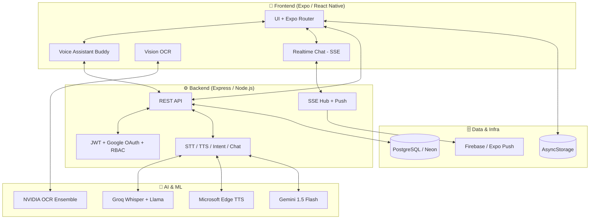

# 🏥 VAni
### *Your AI-Powered, Voice-First Companion for Seamless Post-Hospital Recovery*

[](https://developers.google.com/community/gdsc-solution-challenge)
[](https://expo.dev/)
[](https://nodejs.org/)
[](https://www.postgresql.org/)
[](https://opensource.org/licenses/MIT)

> **📚 New here?** This README is the front door. For deep implementation notes and the full change-log, see **[doc.md](./doc.md)** and **[DOCUMENTATION_INDEX.md](./DOCUMENTATION_INDEX.md)**.

---

## 📖 Overview

**VAni** bridges the dangerous "last mile" between hospital discharge and full recovery. Patients leave with complex prescriptions, confusing instructions, and a daunting follow-up schedule — exactly when they're most vulnerable. VAni turns that chaos into a **structured, voice-first, AI-monitored journey** that keeps patients on track and caregivers informed in real time.

> 🎙️ **Talk to your app, don't navigate it.** Buddy, the built-in voice assistant, lets patients operate the entire app hands-free in **14 languages** — including Hindi, Bengali, Tamil, Telugu, Marathi and more.

### 🎯 Who is it for?
- **Patients** recovering from surgery or managing chronic illness.
- **Caregivers & Family** who need real-time peace of mind.
- **Healthcare providers** who want higher adherence and better outcomes.

---

## ✨ What's New (Latest Updates)

<details>
<summary><b>🆕 Click to expand recent major updates</b></summary>

<br/>

| Area | Update |
| :--- | :--- |
| 🗣️ **Voice TTS** | Migrated to **Microsoft Edge TTS** (neural voices, no API key) with per-language **Indian-language voices** (Hindi, Bengali, Tamil, Telugu, Marathi, Gujarati, Kannada, Malayalam, Urdu…). |
| 🌐 **Multilingual STT** | Smart hybrid language detection — forces the selected language when set, auto-detects otherwise, so "ask in Hindi → reply in Hindi" works correctly. |
| 💬 **Real-time Messaging** | Family ↔ Patient ↔ Caregiver chat over **Server-Sent Events** with **push-notification fallback** and a backend-synced conversation resolver. |
| 🚨 **Emergency upgrades** | Live "call" buttons (Ambulance **108**, Emergency **112**), and emergency triggers now **push-notify all linked caregivers/family**. |
| 📱 **UX fixes** | Scrollable auth screens, keyboard-aware chat input, smoother Google sign-in with a loading state, decluttered sidebar. |
| ☁️ **Deployment** | Hardened Google Cloud Run deploy (env-vars file, startup schema guard, fixed false-success reporting). |

Full details live in **[doc.md → SECTIONS 13–15](./doc.md)**.

</details>

---

## 🌟 Feature Highlights

<details open>
<summary><b>🎙️ Voice-First Assistant ("Buddy")</b></summary>

- **Hands-free control** — navigate, log medicine, log symptoms, switch language, and trigger emergencies by voice.
- **Speech-to-Text** via Groq **Whisper-large-v3-turbo** (multilingual, auto-detect).
- **Text-to-Speech** via **Microsoft Edge TTS** neural voices, localized per language, played through `expo-av` with an on-device fallback so audio never goes silent.
- **Intent routing** — a backend classifier maps natural speech to real app actions (13 navigation targets + medicine/symptom/emergency actions), with a conversational fallback to the Mr. Meddy chatbot.
- **Conversation memory** persisted across sessions and shared between the voice loop and the text chat.
</details>

<details>
<summary><b>📸 Smart OCR Prescription Scanner</b></summary>

- Multi-stage **Vision-Language ensemble**: image preprocessing → text extraction (**NVIDIA Nemotron-Parse** + Tesseract/docTR) → entity extraction (**Gemini 1.5 Flash**).
- Reads handwritten & printed prescriptions; extracts medicine names, dosages, frequencies (OD/BD/TDS) and duration.
- Auto-builds a morning/afternoon/night medication timeline.
</details>

<details>
<summary><b>💬 Real-Time Care Messaging</b></summary>

- 1:1 chat between a **patient** and their linked **caregiver / family** members, scoped per patient.
- **Live delivery** over Server-Sent Events (`/api/chat/stream`); **push notification fallback** when the recipient is offline.
- Backend **conversation resolver** (`/api/chat/conversations`) keeps the right patient context in sync as links change.
- Optimistic send with clear failure feedback (no more silently vanishing messages); keyboard-aware input that rises with the keyboard.
</details>

<details>
<summary><b>💊 Adherence, Gamification & Caregiver Portal</b></summary>

- **Automated scheduler** turns raw prescriptions into reminders.
- **Mascot "Beary"** + XP/streaks build an emotional feedback loop for adherence.
- **Guardian interface**: live dose logs, instant push on missed doses / reported symptoms, remote reminders.
- **Jargon Simplifier** translates medical terms into plain language (Claude / Llama via Groq).
- **Drug Interaction Checker** flags risky combinations.
</details>

<details>
<summary><b>🩸 Blood Network & Medical Card</b></summary>

- **Emergency Blood Network**: location-based donor matching (blood-type compatibility matrix + Haversine distance) and urgent blood requests.
- **Digital Medical QR Card** for first responders.
</details>

---

## 🚨 Emergency & Safety (SOS) Features

> Safety is the headline. Detection is **deterministic and layered** — it works even offline and never depends solely on an LLM.

<details open>
<summary><b>Tap to expand the full SOS suite</b></summary>

<br/>

| Feature | What it does |
| :--- | :--- |
| ⚡ **Smart Emergency Button** | Trigger SOS by **shaking the phone** or **tapping a panic button 5×**. A cancellable countdown protects against accidents, then it alerts caregivers, shares **GPS location via SMS**, and **auto-dials** the emergency number. |
| 🗣️ **Voice Emergency Mode** | Saying *"Help"*, *"Chest pain"*, *"I can't breathe"*, *"call ambulance"* (English/Hindi/Spanish/Urdu/Bengali) instantly opens emergency mode — guarded both **client-side** (works offline) and **server-side**. |
| ❤️ **CPR & Choking Coach** | Voice-guided CPR for Adult/Child/Infant + choking response, with a **110 BPM animated metronome**, compression counter, and a one-tap **call 112** button. |
| 📞 **One-tap Emergency Contacts** | Dial your emergency contact, **Emergency Services (112)**, or **Ambulance (108)** directly from the Emergency screen. |
| 🔔 **Caregiver/Family Alerts** | Triggering an emergency **pushes a real-time alert to every linked caregiver and family member** ("🚨 {name} triggered an emergency alert"). |
| 📴 **Offline Emergency Mode** | Emergency contacts, danger-sign guidance, and dialing all work with no network. |

> *Platform note: in a managed Expo app the OS doesn't expose hardware power/volume key events to JS, so the shipped triggers are a real **accelerometer shake** and an in-app **5× rapid-tap** — both fully functional.*

</details>

---

## 🔒 Security

<details open>
<summary><b>Authentication & Authorization</b></summary>

- **JWT-based sessions** (`jsonwebtoken`); every protected route passes through a `requireAuth` middleware that verifies the token and loads the user.
- **Passwords hashed with bcrypt** (`bcryptjs`) — plaintext passwords are never stored.
- **Google OAuth 2.0** (web + native client IDs) and **email verification codes** for account confirmation.
- **Role-Based Access Control** — `patient` / `caregiver` / `family` / `doctor` roles gate features and data.
- **Relationship-scoped access** — caregivers/family can only reach a patient's data through an explicit, active **`care_links`** relationship; the chat layer validates that both sender and receiver are linked participants (no cross-patient leakage, no "message a stranger" fallback).
</details>

<details>
<summary><b>Backend Hardening</b></summary>

- **Input validation** with **Zod** schemas on API payloads.
- **CORS** and **cookie-parser** configured; structured request logging via **pino**.
- **No raw SQL string-building** — all queries go through **Drizzle ORM** with parameterized statements, eliminating SQL-injection vectors.
- Emergency/notification dispatch is **best-effort and isolated** — a push failure can never crash a request or the server.
- Deterministic, layered emergency detection so a critical safety path doesn't hinge on a single model call.
</details>

<details>
<summary><b>Database & Secrets</b></summary>

- **PostgreSQL (Neon serverless)** over **SSL/TLS** connections.
- **Drizzle ORM** with typed schemas and foreign-key constraints; access is mediated by `care_links` so data is partitioned per patient.
- **Secrets never committed** — the local `.env` is **dotenvx-encrypted**; deployment secrets live in a **git-ignored** `scripts/cloudrun.env.yaml` (or Google Secret Manager) and are injected at runtime via Cloud Run env vars.
- Served over **HTTPS** on Google Cloud Run; tokens transmitted as `Authorization: Bearer` over TLS.
</details>

---

## 🧠 Architecture



---

## 🛠️ Tech Stack

<details>
<summary><b>Expand full stack</b></summary>

**Frontend** — React Native + **Expo**, Expo Router (file-based), Reanimated/Moti animations, `react-native-keyboard-controller`, `expo-av`, React Context state.

**Backend** — Node.js (TypeScript), **Express**, esbuild bundling, **pino** logging, **Drizzle ORM**, **Zod** validation.

**Database** — **PostgreSQL** via **Neon** (serverless), Drizzle migrations.

**AI / ML** — Groq **Whisper-large-v3-turbo** (STT) + **Llama 3.3** (intent/chat), **Microsoft Edge TTS** (voice), **Gemini 1.5 Flash** (prescription parsing), **NVIDIA Nemotron-Parse** + docTR (OCR), Anthropic **Claude** (jargon simplification).

**Realtime / Notifications** — Server-Sent Events, **Expo Push** / Firebase Cloud Messaging.

**Infra** — Google **Cloud Run** (Docker), EAS Build (Android APK).

</details>

---

## ⚙️ Setup & Installation

<details open>
<summary><b>Local development</b></summary>

**Prerequisites:** Node.js 18+, **pnpm**, the Expo Go app (or a dev build for push / Google OAuth).

```bash
git clone https://github.com/your-repo/d-buddy.git
cd d-buddy
pnpm install
```

Create a root `.env`:
```env
# Server
PORT=3000
JWT_SECRET=your_super_secret
DATABASE_URL=your_neon_postgres_url

# Google OAuth (see GOOGLE_OAUTH_SETUP.md)
GOOGLE_CLIENT_ID=...apps.googleusercontent.com
EXPO_PUBLIC_GOOGLE_WEB_CLIENT_ID=...
EXPO_PUBLIC_GOOGLE_ANDROID_CLIENT_ID=...
EXPO_PUBLIC_GOOGLE_IOS_CLIENT_ID=...

# AI providers
GROQ_API_KEY=...
GEMINI_API_KEY=...
ANTHROPIC_API_KEY=...
NVIDIA_API_KEY=...

# Push (optional, needs a dev/standalone build)
FIREBASE_PROJECT_ID=...
FIREBASE_CLIENT_EMAIL=...
FIREBASE_PRIVATE_KEY=...
```

Run the services:
```bash
# Backend
cd artifacts/api-server && pnpm run dev

# Mobile app (separate terminal)
cd artifacts/discharge-buddy && npx expo start
```

> **Note:** Edge TTS needs **no key**. Push notifications & native Google OAuth require a **dev/standalone build** (Expo Go can't obtain push tokens). See [GOOGLE_OAUTH_SETUP.md](./GOOGLE_OAUTH_SETUP.md).

</details>

<details>
<summary><b>Deploy backend to Google Cloud Run</b></summary>

Cloud Run does **not** read your local `.env` — you must pass env vars explicitly, or the container crashes at startup (`DATABASE_URL` is required).

```powershell
# 1. Fill in deployment secrets (git-ignored)
Copy-Item scripts\cloudrun.env.example.yaml scripts\cloudrun.env.yaml
#    -> edit it: DATABASE_URL, GROQ_API_KEY, JWT_SECRET, Firebase, ...  (do NOT add PORT)

# 2. Deploy
gcloud run deploy discharge-buddy-backend --source . --region asia-south1 `
  --allow-unauthenticated --env-vars-file scripts\cloudrun.env.yaml
```

The server runs an **idempotent startup schema guard** that creates the chat `messages` table automatically. `scripts/deploy.ps1` provides a menu-driven wrapper for both Cloud Run and EAS APK builds.

</details>

---

## ▶️ Usage Guide

1. **Sign up** as a **Patient** or **Caregiver/Family**.
2. **Scan** your discharge summary / prescription.
3. **Verify** the AI-extracted medicine list.
4. **Link** — caregivers scan the patient's QR / link code to start monitoring.
5. **Talk to Buddy** — *"I took my medicine"*, *"open my schedule"*, *"call ambulance"*.
6. **Message** your care team in real time, and stay safe with the SOS suite.

---

## 🗺️ Roadmap

- [ ] Telemedicine video calls
- [ ] Wake-word activation ("Hey Buddy")
- [ ] Predictive relapse detection from symptom patterns
- [ ] Shared care timeline (meds, meals, journal, voice notes)
- [ ] Read receipts & unread badges for chat

---

## 🤝 Contributing

1. Fork the project
2. Create a feature branch (`git checkout -b feature/AmazingFeature`)
3. Commit (`git commit -m 'Add AmazingFeature'`)
4. Push (`git push origin feature/AmazingFeature`)
5. Open a Pull Request

---

## 📜 License

Distributed under the MIT License. See `LICENSE` for details.

---

<p align="center">
  <b>Built with ❤️ by the VAni Team</b><br/>
  <i>For the Google Solution Challenge 2026</i>
</p>
