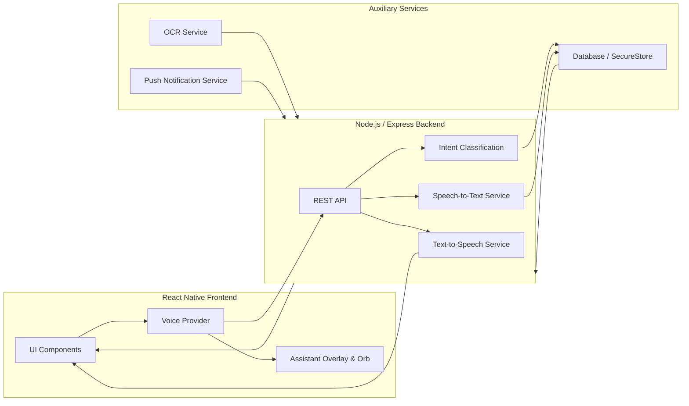

# Discharge Buddy Documentation

## SECTION 1 — Repository Analysis

### Architecture Summary
Discharge Buddy follows a modern React Native (Expo) frontend with an Express/Node.js backend, and a Python-based OCR service. The application uses context-based state management with separate providers for Authentication, Localization, and Voice functionalities. The architecture is designed to support patient-caregiver linked roles, enabling seamless information sharing.

### Dependency Map
- **Frontend**: React Native (Expo), React Navigation (for routing), Context API (State Management)
- **Backend APIs**: Node.js/Express (API Server)
- **OCR Service**: Python-based document scanning microservice
- **Voice Assistant (Buddy)**: Web Speech API / Native STT modules for speech recognition, integrated into the global overlay.

### Risk Areas
- **State Coupling**: Potential tight coupling between chatbot logic and voice overlay.
- **Performance**: Simultaneous running of OCR, voice listening, and rendering complex UI could lead to memory leaks or stuttering, especially on low-end devices.
- **Android Lifecycle**: Voice background processes might be killed by aggressive Android battery optimization.

### Extension Points
- **Provider Layer**: `components/assistant/AssistantProvider.tsx` (voice state machine) and `context/AppContext.tsx` (`language`, `setLanguage`, data access) are well isolated, allowing insertion of advanced NLP routing and translation APIs.
- **Action Handlers**: The intent routing engine lives in `AssistantProvider.tsx` (`handleTranscript` → `handleAction` / `handleChat`) and is driven by the backend classifier at `api-server/src/routes/ai.ts` (`POST /api/ai/intent`). New voice commands are added by extending the backend intent vocabulary plus the `NAV_ROUTES` map / `handleAction` switch.

### Key File Map (actual paths)
| Concern | File |
|---------|------|
| Voice state machine + intent dispatch | `artifacts/discharge-buddy/components/assistant/AssistantProvider.tsx` |
| Global overlay + FAB UI | `artifacts/discharge-buddy/components/assistant/AssistantOverlay.tsx` |
| Reactive orb visualizer | `artifacts/discharge-buddy/components/assistant/VoiceOrb.tsx` |
| Mic lifecycle + VAD + transcript callback | `artifacts/discharge-buddy/hooks/assistant/useVoiceSession.ts` |
| Active-screen context detection | `artifacts/discharge-buddy/hooks/assistant/useAssistantContext.ts` |
| Pub/sub events | `artifacts/discharge-buddy/hooks/assistant/useAssistantEvents.ts` |
| Data provider contract | `artifacts/discharge-buddy/context/types.ts` (`IDataProvider`) |
| Live API client | `artifacts/discharge-buddy/context/ApiProvider.ts` |
| TTS (device speech) | `artifacts/discharge-buddy/context/AppContext.tsx` (`speakNeural`) + `AssistantProvider` (`speak`) |
| Backend AI routes (STT/TTS/chat/intent) | `artifacts/api-server/src/routes/ai.ts` |
| Provider mounted at app root | `artifacts/discharge-buddy/app/_layout.tsx` |

---

## SECTION 2 — Current Voice System Analysis

### Current Implementation Status

**Phase 1 (Completed):**
- Speech-to-text integration
- Microphone permissions handling
- Transcript generation pipeline
- Auto-send logic based on silence detection
- Basic chatbot text integration
- Voice lifecycle (start, stop, error states)

**Phase 2 (Completed):**
- Base assistant provider architecture
- Global overlay architecture (Orb/Blob UI)
- Assistant state management (idle, listening, processing, speaking)
- Session manager for conversational continuity
- Global infrastructure for cross-screen activation
- Foundational context injection

**Phase 3 (Completed) — TTS & Speaking Loop:**
- Buddy now speaks every response via the device speech engine (`expo-speech`), localised to the active language.
- Added a dedicated `speaking` state with a green pulsing orb and on-screen reply text.
- Continuous hands-free loop: after a conversational (CHAT) answer Buddy re-opens the mic automatically; any navigation, action, or cancel ends the loop cleanly.
- Fixed the broken transcript hand-off: `useVoiceSession` now delivers the transcript through an `onTranscript` callback so **auto-send on silence actually drives the pipeline** (previously the auto-stopped transcript was discarded).

**Phase 6 (Completed) — Intent Routing & Actions:**
- Backend intent classifier (`POST /api/ai/intent`) expanded to a full vocabulary: 13 NAVIGATE targets, 9 ACTION targets, plus a `CHAT` conversational intent and `UNKNOWN` fallback.
- Frontend dispatch performs real work: navigates to any tab/modal, marks a pending dose as taken (`TAKE_MEDICINE`), logs symptoms, triggers emergency SOS, logs out, and switches language by voice — each with spoken confirmation.
- Anything not matching an action falls back to a spoken Mr. Meddy chat answer.

**Critical fix — STT backend endpoint:**
The client called `POST /api/ai/stt` but **the route did not exist**, so the entire voice loop was non-functional end-to-end. Implemented it in `api-server/src/routes/ai.ts` using Groq Whisper (`whisper-large-v3-turbo`), with base64 decode, data-URI stripping, per-platform container handling (m4a native / webm web), and a language hint.

### Implementation Matrix

| Feature | Status | Files | Working? | Missing Pieces | Risks |
|---------|--------|-------|----------|----------------|-------|
| STT Engine | Phase 1 + fix | `hooks/assistant/useVoiceSession.ts`, `api-server/src/routes/ai.ts` (`/stt`) | Yes | Streaming partials | Background termination |
| Voice Permissions | Phase 1 | `hooks/assistant/useVoiceSession.ts` (`Audio.requestPermissionsAsync`) | Yes | Re-prompt on revocation | OS updates breaking flows |
| Chatbot Integration | Phase 1 | `app/chat.tsx`, `context/ApiProvider.ts` (`getChatResponse`) | Yes | Shared history with voice | Tight UI coupling |
| Overlay Architecture | Phase 2 | `components/assistant/AssistantOverlay.tsx` | Yes | Z-index conflicts on modals | Performance overhead |
| Assistant States | Phase 2/3 | `components/assistant/AssistantProvider.tsx`, `VoiceOrb.tsx` | Yes | Barge-in interruption | Race conditions in state transitions |
| Session / Conversation Loop | Phase 2/3 | `AssistantProvider.tsx` (`continueConversationRef`) | Yes | Long-term context persistence | Loop wedging if TTS callback never fires |
| Text-to-Speech | Phase 3 | `AssistantProvider.tsx` (`speak`), `AppContext.tsx` (`speakNeural`) | Yes | Cloud (ElevenLabs) voice on device | Audio ducking |
| Intent Routing & Actions | Phase 6 | `AssistantProvider.tsx`, `api-server/src/routes/ai.ts` (`/intent`) | Yes | Slot-filling / multi-turn params | Misclassification on noisy audio |

---

## SECTION 3 — Final Product Vision

### Buddy - The Voice-First Assistant

**Goal:**
Users should operate the app primarily using voice, reducing the need for screen navigation, especially for elderly patients or users with accessibility needs.

**Examples:**
- *"Buddy turn on"*
- *"Open medicine page"*
- *"Write journal"*
- *"Scan this prescription"*
- *"Log me out"*
- *"Change language to Bengali"*
- *"Tell my daughter I took medicine"*
- *"Show activity"*

The assistant should feel like:
*"I am talking to my app."*
not:
*"I am navigating screens."*

**Architecture Required:**
To achieve this, the architecture will pivot from a Screen-First MVC to an **Intent-First Routing Architecture**. The global Voice Provider will intercept speech, process intent, and dispatch actions that either manipulate the screen UI visually or perform operations silently in the background (like logging medicine) while providing auditory feedback.

---

## SECTION 4 — Features to be implemented Matrix

| Feature | Description | Why Needed | Dependencies | Priority | Complexity | Status / Phase |
|---------|-------------|------------|--------------|----------|------------|-----------------|
| Text-to-Speech | Voice playback of app responses | Core "Buddy" experience | AssistantProvider | High | Medium | ✅ Done (Phase 3) |
| Speaking States | Visual orb feedback while talking | User engagement | Overlay UI | High | Low | ✅ Done (Phase 3) |
| Continuous Loop | Keep mic active after response | Hands-free flow | AssistantProvider | High | High | ✅ Done (Phase 3) |
| Intent Routing | Map voice to app actions | Core voice control | Backend `/intent` | High | High | ✅ Done (Phase 6) |
| Medicine Voice Log | "I took my pill" -> Logs it | Ease of use | Medicine Module | High | Medium | ✅ Done (Phase 6) |
| Emergency Triggers | Voice-activated SOS | Safety | Emergency API | High | Medium | ✅ Done (Phase 6) |
| Voice Logout / Lang Switch | "Log me out" / "Speak Hindi" | Hands-free control | AppContext | High | Low | ✅ Done (Phase 6) |
| Multilingual STT | Process native languages (en/hi/es/ur) | Accessibility | Groq Whisper | High | High | ✅ Done (Phase 4, partial) |
| Multilingual TTS | Speak responses in active language | Accessibility | expo-speech locales | High | Medium | ✅ Done (Phase 4, partial) |
| Bengali Support | Add `bn` to UI + voice locales | Target demographic | `constants/translations.ts` | High | Medium | ⏳ Pending (Phase 4) |
| Context Persistence | Remember past conversation turns | Natural dialogue | DB/Storage | Medium | Medium | ⏳ Pending (Phase 5) |
| Family Voice Notes | Voice messages to caregivers | Connectivity | Auth/Roles | Low | Medium | ⏳ Pending (Phase 8) |
| Wake Word | "Hey Buddy" activation | Hands-free init | Native Audio | High | High | ⏳ Pending (Phase 9) |
| Voice Interruption (barge-in) | Stop speaking when user talks | Natural conversation | TTS Engine | Medium | High | ⏳ Pending (Phase 9) |
| Simplified Mode | Large text, high contrast | Accessibility | Settings Context | Medium | Low | ⏳ Pending (Phase 10) |
| Offline Mode | Basic STT without internet | Reliability | Local ML Models | Low | High | ⏳ Pending (Phase 10) |
| Feature            | Backend Changes     | Frontend Changes | DB Changes       | APIs Needed   | Risks         | Dependencies  |
| ------------------ | ------------------- | ---------------- | ---------------- | ------------- | ------------- | ------------- |
| Family Voice Notes | audio event APIs    | recording UI     | voice_note table | notifications | storage costs | push system   |
| Timeline           | aggregation service | timeline screens | event tables     | timeline APIs | duplication   | medicine APIs |


---

## SECTION 5 — Phased Roadmap

### Phase 1: Completed (Foundations)
*Speech-to-text, Permissions, basic chatbot integration.*

### Phase 2: Completed (Overlay & State)
*Global UI overlay, Orb visualizer, session management.*

### Phase 3: ✅ COMPLETED — TTS & Speaking Loop
- **Goals:** Give Buddy a voice and allow continuous back-and-forth dialogue without pressing buttons repeatedly.
- **Dependencies:** `expo-speech` (device speech engine).
- **Files Affected:** `components/assistant/AssistantProvider.tsx` (added `speak`, `speaking` state, `continueConversationRef` loop), `components/assistant/AssistantOverlay.tsx` (speaking status + reply text), `components/assistant/VoiceOrb.tsx` (green speaking pulse).
- **What shipped:** Every reply is spoken in the active language; the orb pulses green while speaking; CHAT turns re-open the mic for hands-free dialogue; actions/navigation end the loop.
- **Risks (handled):** Audio ducking — `Audio.setAudioModeAsync` configured at app root; loop getting stuck — `speak()` always resolves (onDone/onStopped/onError) so the loop can never wedge.
- **Testing Checklist:** ✅ TTS triggers, ✅ UI reflects speaking state, ✅ continuous conversation, ✅ cancel stops speech and loop.

### Phase 4: ⏳ PARTIAL — Multilingual Pipeline
- **Goals:** Support regional languages for both TTS and STT.
- **Done:** STT language hint plumbed end-to-end (`useVoiceSession` → `transcribeAudio(…, language)` → Groq Whisper `language`), and TTS speaks in the active locale (en/hi/es/ur). Whisper auto-detects unknown hints.
- **Remaining:** Bengali (`bn`) is **not yet** in the app's `Language` union — add it to `constants/translations.ts` (currently `"en" | "hi" | "es" | "ur"`) and to `LOCALE_BY_LANG` / `LANG_SWITCH_REPLY` in `AssistantProvider.tsx`. Optional: a cloud translation layer for replies.
- **Dependencies:** `constants/translations.ts`, `utils/translate.ts`.
- **Risks:** Latency in any added translation layer.
- **Testing Checklist:** Speak Hindi/Spanish/Urdu, verify transcript + spoken reply locale; (pending) add and verify Bengali.

### Phase 5: Memory & Persistence
- **Goals:** Enable Buddy to remember context across sessions.
- **Dependencies:** Local SQLite or SecureStore.
- **Files Affected:** `SessionManager.ts`, `api-server/models`.
- **Risks:** Privacy and data security of voice transcripts.
- **Testing Checklist:** Recall previous turns, verify journal linking.

### Phase 6: ✅ COMPLETED — Intent Routing & Actions
- **Goals:** Convert speech like "Open medicines" / "I took my pill" / "Log me out" into real app events.
- **Dependencies:** `expo-router` (imperative `router.push`), backend Groq classifier.
- **Files Affected:** `components/assistant/AssistantProvider.tsx` (`handleTranscript` → `handleAction` / `handleChat`, `NAV_ROUTES` map), `context/ApiProvider.ts` + `context/types.ts` (`getIntent`), `api-server/src/routes/ai.ts` (`POST /api/ai/intent` vocabulary).
- **What shipped:** 13 NAVIGATE targets, ACTION handlers for take-medicine / log-symptom / add-medicine / emergency SOS / logout / language switch, and a CHAT fallback to Mr. Meddy. Every outcome is spoken back.
- **Risks (handled):** Breaking navigation — uses the existing route tree, no new navigator; unmapped/unknown intents degrade gracefully to a chat answer instead of erroring.
- **Testing Checklist:** ✅ Navigation intents route correctly, ✅ "I took my medicine" marks a pending dose taken, ✅ emergency + logout + language switch fire, ✅ chit-chat falls back to chat.

### Phase 7: Context Engine
- **Goals:** Buddy knows what screen the user is looking at to resolve ambiguous queries ("What is this?").
- **Dependencies:** Navigation state listener.
- **Files Affected:** `ContextEngine.ts`.
- **Risks:** Stale state leading to wrong context.
- **Testing Checklist:** Ask contextual questions on 3 different screens.

### Phase 8: ⏳ PARTIAL — Medicine & Caregiver Ecosystem
- **Goals:** Full voice operation for medicine logging and alerting caregivers.
- **Done:** Voice medicine logging (`TAKE_MEDICINE` → `updateDoseStatus`) and voice emergency SOS (`TRIGGER_EMERGENCY` → `triggerEmergency` + navigate) ship in Phase 6.
- **Remaining:** Voice messages/notes to caregivers, and confirming the caregiver push round-trip from a voice action.
- **Dependencies:** Medicine API (done), `utils/NotificationHelper.ts`, caregiver routes.
- **Risks:** Logging the wrong dose when multiple are pending — current logic picks the first pending dose; add disambiguation ("which one?") in a future slot-filling turn.
- **Testing Checklist:** ✅ Voice-log a dose; (pending) verify caregiver receives push notification.

### Phase 9: Wake Word System
- **Goals:** Hands-free activation.
- **Dependencies:** Native wake-word SDKs (e.g., Porcupine).
- **Files Affected:** Native Android/iOS modules.
- **Risks:** High battery drain, false positives.
- **Testing Checklist:** Say wake word from sleep mode, check battery impact.

### Phase 10: Optimization
- **Goals:** Offline mode, battery profiling, animation cleanup.

---

## PROJECT VISION

We are building:

**Bora**

A voice-first care companion connecting:

* patients
* caregivers
* families

The goal is:

Users should eventually operate the application primarily through voice.

This is NOT only a chatbot.

This is a care ecosystem.

Core philosophy:

- Reduce cognitive burden.
- Reduce caregiver burden.
- Increase family connection.
- Make users feel less alone.
- Support elderly and non-technical users.

---

### Phase 11
### P0 FEATURES (Highest Priority)

1. **Family Voice Notes + Smart Notifications**

Highest Priority.

Goal:

Caregivers and family members should be able to send voice notes or reminders.

Patient should receive:

* notifications
* scheduled reminders
* voice playback
* text fallback

Example:

"Dad, don't forget medicine ❤️"

OR

Patient:

"Bora, tell my daughter I had lunch."

Flow:

Voice → Intent detection → Store event → Create family update → Send push notification → Store timeline event

Include implementation details:

* notification system
* audio storage
* transcript storage
* scheduling
* reminder engine
* push notifications
* database schema

Explain why this is emotionally powerful.

### Phase 12
2. **Shared Care Timeline**

Include:

- medicine logs
- meal logs
- journal logs
- voice note events
- activity logs
- family interactions

---

## ARCHITECTURE OVERVIEW

Below is a high‑level diagram of the **Bora** voice‑first care ecosystem, showing the main modules and their interactions.



13. **Medication Companion**

Include:

- voice reminders
- missed medicine detection
- confirmation loops
- caregiver updates

14. **Multilingual Voice Pipeline**

Support:

- Bengali
- English
- Mixed speech
- Language persistence
- Guardian preferences

---

## P1 FEATURES

- Context engine
- intent routing
- voice journaling
- daily companion mode
- family presence layer
- routine detection
- caregiver dashboard
- memory support

---

## P2 FEATURES

- wake word
- emotional adaptation
- analytics
- offline mode
- battery optimization

---

## MOST IMPORTANT RULE

Do not break:

* authentication
* OCR
* navigation
* medicine systems
* journal systems
* chatbot
* multilingual systems
* APIs
* existing flows

Every new feature must be modular.

Avoid chatbot‑specific implementations.

---


## Current Voice System Status

Document current implementation.

Include:

**Phase 1:**

* STT
* permissions
* auto‑send
* chatbot integration
* speech pipeline

**Phase 2:**

* assistant provider
* global overlay
* orb/blob
* state machine
* context foundation
* voice session manager


---


## SECTION 6 — Demo Narrative

**Flow (✅ = supported today, ⏳ = roadmap):**
1. **Patient taps the mic FAB.** ✅ (wake word "Hey Buddy" is ⏳ Phase 9)
2. **Buddy greets / answers via TTS.** ✅ Spoken reply in the active language.
3. **User speaks Hindi:** *"Maine apni dawai le li."* ✅ (STT via Groq Whisper with `hi` hint; Bengali `bn` is ⏳ Phase 4)
4. **Assistant responds correctly:** ✅ Intent `TAKE_MEDICINE` marks the pending dose taken in the background and speaks "Done. I've marked … as taken."
5. **OCR scans prescription:** ✅ "Scan a prescription" navigates to the scanner (`/scan`); parsing already exists via `POST /api/ocr/scan`.
6. **Journal / symptoms by voice:** ✅ Navigation + symptom logging; ⏳ free‑text "write in my journal that…" dictation is future slot‑filling.
7. **Caregiver receives updates:** ⏳ Push round‑trip from a voice action (Phase 8 remaining).
8. **Hands‑free operation:** ✅ Continuous loop keeps the mic open across conversational turns.

**Why this demo is compelling:**
It demonstrates a complete paradigm shift. The application stops being a digital form the patient has to fill out, and becomes an invisible companion that naturally integrates into their daily life. It solves the core problem of digital literacy and physical limitations for elderly patients, while providing immense peace of mind to the caregiver network.


**Flow (✅ = supported today, ⏳ = roadmap):**
1. **Patient taps the mic FAB.** ✅ (wake word "Hey Buddy" is ⏳ Phase 9)
2. **Buddy greets / answers via TTS.** ✅ Spoken reply in the active language.
3. **User speaks Hindi:** *"Maine apni dawai le li."* ✅ (STT via Groq Whisper with `hi` hint; Bengali `bn` is ⏳ Phase 4)
4. **Assistant responds correctly:** ✅ Intent `TAKE_MEDICINE` marks the pending dose taken in the background and speaks *"Done. I've marked … as taken."*
5. **OCR scans prescription:** ✅ *"Scan a prescription"* navigates to the scanner (`/scan`); parsing already exists via `POST /api/ocr/scan`.
6. **Journal / symptoms by voice:** ✅ Navigation + symptom logging; ⏳ free-text "write in my journal that…" dictation is future slot-filling.
7. **Caregiver receives updates:** ⏳ Push round-trip from a voice action (Phase 8 remaining).
8. **Hands-free operation:** ✅ Continuous loop keeps the mic open across conversational turns.

**Why this demo is compelling:**
It demonstrates a complete paradigm shift. The application stops being a digital form the patient has to fill out, and becomes an invisible companion that naturally integrates into their daily life. It solves the core problem of digital literacy and physical limitations for elderly patients, while providing immense peace of mind to the caregiver network.

---

## SECTION 7 — Risks + Missing Pieces

| Risk | Severity | Impact | Suggested Fix |
|------|----------|--------|---------------|
| **Battery Drain (Wake Word)** | High | App gets uninstalled | Use hardware-accelerated DSP wake-word engines and sleep aggressively. |
| **Android Lifecycle Kills** | High | Silent failures | Implement robust Foreground Services with persistent notification for Voice Provider. |
| **Voice Overlap / Barge-in** | Medium | Frustrating UX | Implement local echo cancellation and interrupt flags in `VoiceProvider`. |
| **Multilingual Latency** | Medium | Unnatural pauses | Edge-based language detection and optimistic UI updates. |
| **Permissions Revocation** | Low | STT breaks silently | Add app-state listener to re-prompt gracefully if permissions are revoked in settings. |
| **Performance Overhead** | Medium | UI stutters | Offload OCR and heavy processing to Web Workers or Native Threads via Reanimated. |

---

## SECTION 8 — Output Format Notes

*Note to contributors:*
This document acts as the definitive roadmap for Discharge Buddy. When adding new features, always ask: **"How does this work with voice?"**
Do not build features that can only be accessed via deep, nested UI menus. Ensure all core actions are exposed via the Intent Router.

---

## SECTION 9 — Build, Run & Verification

### End-to-end voice flow (what happens on a tap)
1. User taps the mic FAB (`AssistantOverlay`) → `AssistantProvider.startAssistant()`.
2. `useVoiceSession.startSession()` requests mic permission and records (m4a native / webm web) with live metering driving the orb.
3. Silence detector (VAD) auto-stops — or the user taps **Send Now** — and the recording is transcribed via `POST /api/ai/stt` (Groq Whisper).
4. The transcript is delivered through the `onTranscript` callback to `handleTranscript`.
5. `POST /api/ai/intent` classifies the text → NAVIGATE / ACTION / CHAT / UNKNOWN.
6. The provider navigates, performs the action, or asks `POST /api/ai/chat`, then **speaks the result**. CHAT turns re-open the mic for hands-free dialogue.

### Required environment (api-server `.env`)
- `GROQ_API_KEY` — **required** for STT, intent, and chat (Groq Llama + Whisper).
- `ELEVENLABS_API_KEY`, `ELEVENLABS_VOICE_ID` — optional, only for the cloud TTS route (`/api/ai/tts`); on-device TTS via `expo-speech` needs no key.
- `EXPO_PUBLIC_API_URL` — frontend → backend base URL.

### Build / verify commands
```bash
# Backend: typecheck + bundle
cd artifacts/api-server && pnpm run typecheck && pnpm run build

# Frontend: typecheck
cd artifacts/discharge-buddy && pnpm run typecheck

# Frontend: production web/native bundle (Expo)
#   needs a deployment domain; locally a dummy works:
EXPO_PUBLIC_DOMAIN="localhost:8081" pnpm run build
```

### Verification status (last run)
- ✅ `api-server` typecheck: clean.
- ✅ `api-server` esbuild bundle: clean.
- ✅ `discharge-buddy` typecheck: clean (the previous `/(tabs)/` route-type error is fixed).
- ✅ `discharge-buddy` Expo production build: iOS + Android bundles compiled and minified.
- ℹ️ `mockup-sandbox` build requires a `PORT` env var at build time (pre-existing, unrelated to the voice system).

### Files changed in this iteration
- `api-server/src/routes/ai.ts` — **added** `POST /api/ai/stt` (Groq Whisper); **expanded** `POST /api/ai/intent` vocabulary.
- `discharge-buddy/components/assistant/AssistantProvider.tsx` — full rewrite: intent dispatch, real actions, TTS, hands-free loop.
- `discharge-buddy/components/assistant/AssistantOverlay.tsx` — speaking state + reply text.
- `discharge-buddy/components/assistant/VoiceOrb.tsx` — speaking visual state.
- `discharge-buddy/hooks/assistant/useVoiceSession.ts` — `onTranscript` callback, per-platform format, language hint.
- `discharge-buddy/context/{types.ts,ApiProvider.ts,MockProvider.ts}` — `transcribeAudio(audioBase64, fileExtension?, language?)`.


## SECTION 5 — PHASE ROADMAP

Create roadmap.

Phase 3:

- TTS + speaking loop

Phase 4:

- Multilingual pipeline

Phase 5:

- Family voice notes + notifications

Phase 6:

- Timeline + caregiver ecosystem

Phase 7:

- Intent routing + actions

Phase 8:

- Context engine

Phase 9:

- Wake word

Phase 10:

- Optimization

For every phase:

- goals
- files affected
- risks
- testing plan
- rollback plan

---

## SECTION 6 — DEMO STORY

Build story around:

Patient wakes up → Bora reminds medicine → Family reminder voice note plays → Patient speaks Bengali → Bora responds correctly → Patient logs lunch → Family notified automatically → Caregiver sees timeline → Patient feels connected

Explain why this demo creates emotional attachment.

---