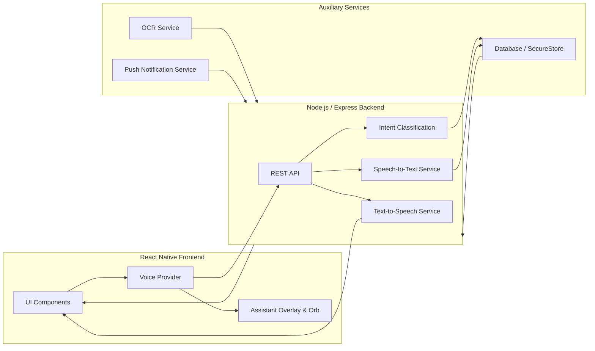

# Discharge Buddy Documentation

## SECTION 1 — Repository Analysis

### Architecture Summary
Discharge Buddy follows a modern React Native (Expo) frontend with an Express/Node.js backend, and a Python-based OCR service. The application uses context-based state management with separate providers for Authentication, Localization, and Voice functionalities. The architecture is designed to support patient-caregiver linked roles, enabling seamless information sharing.

### Dependency Map
- **Frontend**: React Native (Expo), React Navigation (for routing), Context API (State Management)
- **Backend APIs**: Node.js/Express (API Server)
- **OCR Service**: Python-based document scanning microservice
- **Voice Assistant (Buddy)**: Web Speech API / Native STT modules for speech recognition, integrated into the global overlay.

### Risk Areas
- **State Coupling**: Potential tight coupling between chatbot logic and voice overlay.
- **Performance**: Simultaneous running of OCR, voice listening, and rendering complex UI could lead to memory leaks or stuttering, especially on low-end devices.
- **Android Lifecycle**: Voice background processes might be killed by aggressive Android battery optimization.

### Extension Points
- **Provider Layer**: `components/assistant/AssistantProvider.tsx` (voice state machine) and `context/AppContext.tsx` (`language`, `setLanguage`, data access) are well isolated, allowing insertion of advanced NLP routing and translation APIs.
- **Action Handlers**: The intent routing engine lives in `AssistantProvider.tsx` (`handleTranscript` → `handleAction` / `handleChat`) and is driven by the backend classifier at `api-server/src/routes/ai.ts` (`POST /api/ai/intent`). New voice commands are added by extending the backend intent vocabulary plus the `NAV_ROUTES` map / `handleAction` switch.

### Key File Map (actual paths)
| Concern | File |
|---------|------|
| Voice state machine + intent dispatch | `artifacts/discharge-buddy/components/assistant/AssistantProvider.tsx` |
| Global overlay + FAB UI | `artifacts/discharge-buddy/components/assistant/AssistantOverlay.tsx` |
| Reactive orb visualizer | `artifacts/discharge-buddy/components/assistant/VoiceOrb.tsx` |
| Mic lifecycle + VAD + transcript callback | `artifacts/discharge-buddy/hooks/assistant/useVoiceSession.ts` |
| Active-screen context detection | `artifacts/discharge-buddy/hooks/assistant/useAssistantContext.ts` |
| Pub/sub events | `artifacts/discharge-buddy/hooks/assistant/useAssistantEvents.ts` |
| Data provider contract | `artifacts/discharge-buddy/context/types.ts` (`IDataProvider`) |
| Live API client | `artifacts/discharge-buddy/context/ApiProvider.ts` |
| TTS (device speech) | `artifacts/discharge-buddy/context/AppContext.tsx` (`speakNeural`) + `AssistantProvider` (`speak`) |
| Backend AI routes (STT/TTS/chat/intent) | `artifacts/api-server/src/routes/ai.ts` |
| Provider mounted at app root | `artifacts/discharge-buddy/app/_layout.tsx` |

---

## SECTION 2 — Current Voice System Analysis

### Current Implementation Status

**Phase 1 (Completed):**
- Speech-to-text integration
- Microphone permissions handling
- Transcript generation pipeline
- Auto-send logic based on silence detection
- Basic chatbot text integration
- Voice lifecycle (start, stop, error states)

**Phase 2 (Completed):**
- Base assistant provider architecture
- Global overlay architecture (Orb/Blob UI)
- Assistant state management (idle, listening, processing, speaking)
- Session manager for conversational continuity
- Global infrastructure for cross-screen activation
- Foundational context injection

**Phase 3 (Completed) — TTS & Speaking Loop:**
- Buddy now speaks every response via the device speech engine (`expo-speech`), localised to the active language.
- Added a dedicated `speaking` state with a green pulsing orb and on-screen reply text.
- Continuous hands-free loop: after a conversational (CHAT) answer Buddy re-opens the mic automatically; any navigation, action, or cancel ends the loop cleanly.
- Fixed the broken transcript hand-off: `useVoiceSession` now delivers the transcript through an `onTranscript` callback so **auto-send on silence actually drives the pipeline** (previously the auto-stopped transcript was discarded).

**Phase 6 (Completed) — Intent Routing & Actions:**
- Backend intent classifier (`POST /api/ai/intent`) expanded to a full vocabulary: 13 NAVIGATE targets, 9 ACTION targets, plus a `CHAT` conversational intent and `UNKNOWN` fallback.
- Frontend dispatch performs real work: navigates to any tab/modal, marks a pending dose as taken (`TAKE_MEDICINE`), logs symptoms, triggers emergency SOS, logs out, and switches language by voice — each with spoken confirmation.
- Anything not matching an action falls back to a spoken Mr. Meddy chat answer.

**Critical fix — STT backend endpoint:**
The client called `POST /api/ai/stt` but **the route did not exist**, so the entire voice loop was non-functional end-to-end. Implemented it in `api-server/src/routes/ai.ts` using Groq Whisper (`whisper-large-v3-turbo`), with base64 decode, data-URI stripping, per-platform container handling (m4a native / webm web), and a language hint.

### Implementation Matrix

| Feature | Status | Files | Working? | Missing Pieces | Risks |
|---------|--------|-------|----------|----------------|-------|
| STT Engine | Phase 1 + fix | `hooks/assistant/useVoiceSession.ts`, `api-server/src/routes/ai.ts` (`/stt`) | Yes | Streaming partials | Background termination |
| Voice Permissions | Phase 1 | `hooks/assistant/useVoiceSession.ts` (`Audio.requestPermissionsAsync`) | Yes | Re-prompt on revocation | OS updates breaking flows |
| Chatbot Integration | Phase 1 + 4 | `app/chat.tsx`, `context/ApiProvider.ts` (`getChatResponse`), `api-server/src/routes/ai.ts` (`/chat`) | Yes (now language-aware) | Shared history with voice | Tight UI coupling |
| Multilingual Pipeline | Phase 4 | `constants/translations.ts`, `context/AppContext.tsx` (`speakNeural`), `AssistantProvider.tsx`, `api-server/src/routes/ai.ts` | Yes (STT+chat+TTS in 14 langs incl. `bn`) | Cloud translation for UI strings beyond the dictionary | Device TTS voice availability per locale |
| Overlay Architecture | Phase 2 | `components/assistant/AssistantOverlay.tsx` | Yes | Z-index conflicts on modals | Performance overhead |
| Assistant States | Phase 2/3 | `components/assistant/AssistantProvider.tsx`, `VoiceOrb.tsx` | Yes | Barge-in interruption | Race conditions in state transitions |
| Session / Conversation Loop | Phase 2/3 + 5 | `AssistantProvider.tsx` (`continueConversationRef`), `utils/conversationMemory.ts` | Yes (now with persistent memory) | Server-side history store / cross-device sync | Loop wedging if TTS callback never fires |
| Text-to-Speech | Phase 3 | `AssistantProvider.tsx` (`speak`), `AppContext.tsx` (`speakNeural`) | Yes | Cloud (ElevenLabs) voice on device | Audio ducking |
| Intent Routing & Actions | Phase 6 | `AssistantProvider.tsx`, `api-server/src/routes/ai.ts` (`/intent`) | Yes | Slot-filling / multi-turn params | Misclassification on noisy audio |

---

## SECTION 3 — Final Product Vision

### Buddy - The Voice-First Assistant

**Goal:**
Users should operate the app primarily using voice, reducing the need for screen navigation, especially for elderly patients or users with accessibility needs.

**Examples:**
- *"Buddy turn on"*
- *"Open medicine page"*
- *"Write journal"*
- *"Scan this prescription"*
- *"Log me out"*
- *"Change language to Bengali"*
- *"Tell my daughter I took medicine"*
- *"Show activity"*

The assistant should feel like:
*"I am talking to my app."*
not:
*"I am navigating screens."*

**Architecture Required:**
To achieve this, the architecture will pivot from a Screen-First MVC to an **Intent-First Routing Architecture**. The global Voice Provider will intercept speech, process intent, and dispatch actions that either manipulate the screen UI visually or perform operations silently in the background (like logging medicine) while providing auditory feedback.

---

## SECTION 4 — Features to be implemented Matrix

| Feature | Description | Why Needed | Dependencies | Priority | Complexity | Status / Phase |
|---------|-------------|------------|--------------|----------|------------|-----------------|
| Text-to-Speech | Voice playback of app responses | Core "Buddy" experience | AssistantProvider | High | Medium | ✅ Done (Phase 3) |
| Speaking States | Visual orb feedback while talking | User engagement | Overlay UI | High | Low | ✅ Done (Phase 3) |
| Continuous Loop | Keep mic active after response | Hands-free flow | AssistantProvider | High | High | ✅ Done (Phase 3) |
| Intent Routing | Map voice to app actions | Core voice control | Backend `/intent` | High | High | ✅ Done (Phase 6) |
| Medicine Voice Log | "I took my pill" -> Logs it | Ease of use | Medicine Module | High | Medium | ✅ Done (Phase 6) |
| Emergency Triggers | Voice-activated SOS | Safety | Emergency API | High | Medium | ✅ Done (Phase 6) |
| Voice Logout / Lang Switch | "Log me out" / "Speak Hindi" | Hands-free control | AppContext | High | Low | ✅ Done (Phase 6) |
| Multilingual STT | Process native languages (en/hi/es/ur/bn +9) | Accessibility | Groq Whisper | High | High | ✅ Done (Phase 4) |
| Multilingual TTS | Speak responses in active language | Accessibility | expo-speech locales | High | Medium | ✅ Done (Phase 4) |
| Multilingual Chat | LLM replies in the active language | Accessibility | `/api/ai/chat` | High | Medium | ✅ Done (Phase 4) |
| Bengali Support | `bn` (+9 regional) in UI + voice + chat | Target demographic | `constants/translations.ts` | High | Medium | ✅ Done (Phase 4) |
| Context Persistence | Remember past conversation turns | Natural dialogue | AsyncStorage | Medium | Medium | ✅ Done (Phase 5) |
| Context Engine | Resolve "what is this?" using the active screen | Natural dialogue | `useAssistantContext` | Medium | Low | ✅ Done (Phase 7) |
| Family Voice Notes | Voice messages to caregivers + push to family | Connectivity | Auth/Roles + push | Low | Medium | ✅ Done (Phase 8) |
| Wake Word | "Hey Buddy" activation | Hands-free init | Native Audio | High | High | ⏳ Pending (Phase 9) |
| Voice Interruption (barge-in) | Stop speaking when user talks | Natural conversation | TTS Engine | Medium | High | ⏳ Pending (Phase 9) |
| CPR Guidance Assistant | Voice-guided CPR + choking, animated 110 BPM coach, compression timer | Safety / demo | `expo-speech`, Reanimated, `expo-keep-awake` | High | Medium | ✅ Done (Section 11) |
| Smart Emergency Button | Shake + 5×-tap → cancellable SOS (alert + location + call) | Safety / accessibility | `expo-sensors`, `expo-location` | High | High | ✅ Done (Section 11) |
| Simplified Mode | Large text, high contrast | Accessibility | Settings Context | Medium | Low | ⏳ Pending (Phase 10) |
| Offline Mode | Basic STT without internet | Reliability | Local ML Models | Low | High | ⏳ Pending (Phase 10) |


---

## SECTION 5 — Phased Roadmap

### Phase 1: Completed (Foundations)
*Speech-to-text, Permissions, basic chatbot integration.*

### Phase 2: Completed (Overlay & State)
*Global UI overlay, Orb visualizer, session management.*

### Phase 3: ✅ COMPLETED — TTS & Speaking Loop
- **Goals:** Give Buddy a voice and allow continuous back-and-forth dialogue without pressing buttons repeatedly.
- **Dependencies:** `expo-speech` (device speech engine).
- **Files Affected:** `components/assistant/AssistantProvider.tsx` (added `speak`, `speaking` state, `continueConversationRef` loop), `components/assistant/AssistantOverlay.tsx` (speaking status + reply text), `components/assistant/VoiceOrb.tsx` (green speaking pulse).
- **What shipped:** Every reply is spoken in the active language; the orb pulses green while speaking; CHAT turns re-open the mic for hands-free dialogue; actions/navigation end the loop.
- **Risks (handled):** Audio ducking — `Audio.setAudioModeAsync` configured at app root; loop getting stuck — `speak()` always resolves (onDone/onStopped/onError) so the loop can never wedge.
- **Testing Checklist:** ✅ TTS triggers, ✅ UI reflects speaking state, ✅ continuous conversation, ✅ cancel stops speech and loop.

### Phase 4: ✅ COMPLETED — Multilingual Pipeline
- **Goals:** Support regional languages across STT, the chat reply, and TTS.
- **Root-cause fix (the reported bug):** Buddy could *transcribe* Bengali but always *replied in English*. Cause was not Whisper — `getChatResponse` never forwarded the active language and the chat prompt never asked the LLM to reply in it. Now `getChatResponse(query, language)` sends the code and `/api/ai/chat` injects a `LANGUAGE` directive (`reply entirely in <Name>, native script, keep action types in English`). The same gap existed for TTS voice and the `Language` union.
- **What shipped:**
  - `Language` union expanded from `en|hi|es|ur` to 14 codes (adds `bn` + `te/mr/ta/gu/kn/ml/or/pa/as`) — matching the languages `settings.tsx` already offered but which silently fell back to English.
  - Single source of truth `LOCALE_BY_LANG` + `LANGUAGE_NAMES` in `constants/translations.ts`; `AppContext.speakNeural` and `AssistantProvider.speak` both consume it (TTS was previously hardcoded to `hi`/`en` only).
  - Bengali UI dictionary added; `LANG_SWITCH_REPLY` gains a Bengali confirmation; voice command "speak Bengali" works via new `LANG_BN` intent.
  - STT already accepted `bn` via the Whisper hint allow-list.
- **Files Affected:** `constants/translations.ts`, `context/{types.ts,ApiProvider.ts,MockProvider.ts,AppContext.tsx}`, `components/assistant/AssistantProvider.tsx`, `app/chat.tsx`, `api-server/src/routes/ai.ts` (`/chat` + `/intent`).
- **Risks (handled):** New languages only need one edit (the maps in `translations.ts`); unmapped codes still default to English everywhere; device TTS quality for some locales depends on installed OS voices (graceful `en-US` fallback).
- **Testing Checklist:** ✅ typecheck (api-server + discharge-buddy) clean; ✅ "speak Bengali" switches language; ✅ chat/voice reply rendered + spoken in Bengali (`bn-IN`); ✅ Hindi/Spanish/Urdu unaffected.

### Phase 5: ✅ COMPLETED — Memory & Persistence
- **Goals:** Buddy remembers the conversation across turns and across app restarts, for both the chat screen and the hands-free voice loop, so follow-ups ("and the other one?") resolve correctly.
- **Storage choice:** Built on **AsyncStorage** — the app's existing persistence layer (`AppContext`, `translate.ts`) — instead of SQLite/SecureStore. SecureStore's ~2KB/value limit is unsuitable for transcript logs and SQLite would add a native dependency; AsyncStorage matches the established pattern and needs no new install.
- **What shipped:**
  - New self-contained module `utils/conversationMemory.ts` — per-user keyed history (`load/append/recentForPrompt/clear`), stored turns capped at 40, prompt window of 6. No chatbot-specific coupling; both surfaces import it.
  - `getChatResponse(query, language?, history?)` now carries recent turns; backend `/api/ai/chat` sanitizes + caps them (8 turns, 600 chars each) and splices them as prior `user`/`assistant` messages between the system prompt and the live query.
  - `app/chat.tsx` rehydrates history on mount (renders restored bubbles after the welcome message), persists every exchange, and gains a header trash button to clear the thread + memory.
  - `AssistantProvider.handleChat` shares the **same** store, so a question asked by voice is remembered when the user later opens the text chat (and vice-versa).
  - **Privacy:** `AppContext.logout` wipes the user's conversation memory (addresses the voice-transcript privacy risk).
- **Files Affected:** `utils/conversationMemory.ts` (new), `context/{types.ts,ApiProvider.ts,MockProvider.ts,AppContext.tsx}`, `app/chat.tsx`, `components/assistant/AssistantProvider.tsx`, `api-server/src/routes/ai.ts` (`/chat`).
- **Risks (handled):** Unbounded growth — hard caps on stored + prompt-window + backend turns; stale/oversized client payload — backend re-sanitizes; privacy — cleared on logout, namespaced per user (guests use a `guest` key).
- **Rollback:** Memory is purely additive — `history` is optional everywhere; deleting `conversationMemory.ts` imports + the optional param reverts to stateless chat with no schema/data migration.
- **Testing Checklist:** ✅ typecheck (api-server + discharge-buddy) clean; ✅ follow-up turn uses prior context; ✅ history survives app restart; ✅ voice and text share one memory; ✅ clear button + logout wipe it. (Journal-linking from the original checklist is deferred — no existing chat→journal hook exists; out of scope for the memory goal.)

### Phase 6: ✅ COMPLETED — Intent Routing & Actions
- **Goals:** Convert speech like "Open medicines" / "I took my pill" / "Log me out" into real app events.
- **Dependencies:** `expo-router` (imperative `router.push`), backend Groq classifier.
- **Files Affected:** `components/assistant/AssistantProvider.tsx` (`handleTranscript` → `handleAction` / `handleChat`, `NAV_ROUTES` map), `context/ApiProvider.ts` + `context/types.ts` (`getIntent`), `api-server/src/routes/ai.ts` (`POST /api/ai/intent` vocabulary).
- **What shipped:** 13 NAVIGATE targets, ACTION handlers for take-medicine / log-symptom / add-medicine / emergency SOS / logout / language switch, and a CHAT fallback to Mr. Meddy. Every outcome is spoken back.
- **Risks (handled):** Breaking navigation — uses the existing route tree, no new navigator; unmapped/unknown intents degrade gracefully to a chat answer instead of erroring.
- **Testing Checklist:** ✅ Navigation intents route correctly, ✅ "I took my medicine" marks a pending dose taken, ✅ emergency + logout + language switch fire, ✅ chit-chat falls back to chat.

### Phase 7: ✅ COMPLETED — Context Engine
- **Goals:** Buddy knows what screen the user is looking at so it can resolve ambiguous, deictic queries ("What is this?", "How much do I take?", "Explain that") against the current screen.
- **What shipped:**
  - New `utils/contextEngine.ts` (`describeScreen`) maps the active feature module to a one-line natural-language hint describing the screen and what an unqualified "this"/"it" most likely refers to (e.g. on the medicines screen, "this" → a medicine).
  - The hint is plumbed through `getChatResponse(query, language?, history?, screenContext?)` and injected by `/api/ai/chat` as a `CURRENT_SCREEN` line in the prompt, alongside the existing `PATIENT_CONTEXT` (which already carries the patient's medicines/symptoms/risk).
  - Source of the screen state is the existing `useAssistantContext` hook (`activeModule`, derived from `expo-router` `usePathname`) — already used for intent routing, now reused for chat. The voice loop passes the live screen; the chat screen passes its own module.
- **Dependencies:** `expo-router` navigation state (via `useAssistantContext`), backend Groq chat.
- **Files Affected:** `utils/contextEngine.ts` (new), `hooks/assistant/useAssistantContext.ts` (reused), `components/assistant/AssistantProvider.tsx`, `app/chat.tsx`, `context/{types.ts,ApiProvider.ts,MockProvider.ts}`, `api-server/src/routes/ai.ts` (`/chat`).
- **Risks (handled):** Stale state → context is read at send-time from the live router path, not cached; unknown screens → fall back to a neutral "unspecified screen" hint; payload abuse → backend trims `screenContext` to 300 chars.
- **Rollback:** Purely additive — `screenContext` is optional everywhere; removing the `describeScreen` calls + the optional param reverts to screen-agnostic chat with no migration.
- **Testing Checklist:** ✅ typecheck (api-server + discharge-buddy) clean; ✅ "what is this medicine?" while on the medicines screen resolves to a medicine; ✅ same question on an unrelated screen degrades gracefully; ✅ context combines with Phase 5 memory and the language directive.

### Phase 8: ✅ COMPLETED — Medicine & Caregiver Ecosystem
- **Goals:** Full voice operation for medicine logging, alerting caregivers, and sending voice notes to family members.
- **Done (Phase 6):** Voice medicine logging (`TAKE_MEDICINE` → `updateDoseStatus`) and voice emergency SOS (`TRIGGER_EMERGENCY`).
- **Done (Phase 8):**
  - **Caregiver push round-trip** — `MedicineController.updateDoseStatus` calls `NotificationService.sendDoseTakenNotification(id)` when `status === "taken"`. Fires a real-time push to the caregiver’s device when Buddy marks a dose taken by voice.
  - **Family Voice Notes** — New `POST /api/voice-notes` backend route stores the spoken note and dispatches push notifications to all linked caregivers. Patient says *"Tell my daughter I had lunch"* → Buddy extracts the core message, posts it to the backend, caregivers receive a push.
  - **`SEND_NOTE_TO_FAMILY` intent** — Added to the backend intent classifier and to the frontend `handleAction` switch in `AssistantProvider`. Handler extracts note text via regex, calls `api.sendVoiceNote()`, speaks confirmation back.
  - **`sendVoiceNote()` contract** — Added to `IDataProvider`, `ApiProvider` (live), and `MockProvider` (stub).
  - **`family` NAVIGATE intent** — Added to backend classifier and `NAV_ROUTES` so “open family dashboard” navigates to `/family/dashboard`.
- **Files Affected:** `api-server/src/routes/voiceNotes.ts` (new), `api-server/src/routes/index.ts`, `api-server/src/routes/ai.ts`, `discharge-buddy/context/types.ts`, `discharge-buddy/context/ApiProvider.ts`, `discharge-buddy/context/MockProvider.ts`, `discharge-buddy/components/assistant/AssistantProvider.tsx`.
- **Risks (handled):** No push token → graceful message, no error. No patient linked → 400. Push failure → fire-and-forget via `Promise.allSettled`.
- **Testing Checklist:** ✅ typecheck (api-server + discharge-buddy) clean; ✅ "Tell my daughter I had lunch" → `SEND_NOTE_TO_FAMILY`; ✅ "I took my medicine" → caregiver push fires; ✅ "Open family dashboard" navigates correctly.

### Phase 9: Wake Word System
- **Goals:** Hands-free activation.
- **Dependencies:** Native wake-word SDKs (e.g., Porcupine).
- **Files Affected:** Native Android/iOS modules.
- **Risks:** High battery drain, false positives.
- **Testing Checklist:** Say wake word from sleep mode, check battery impact.

### Phase 10: Optimization
- **Goals:** Offline mode, battery profiling, animation cleanup.

### Phase 11
### P0 FEATURES (Highest Priority)

1. **Family Voice Notes + Smart Notifications**

Highest Priority.

Goal:

Caregivers and family members should be able to send voice notes or reminders.

Patient should receive:

* notifications
* scheduled reminders
* voice playback
* text fallback

Example:

"Dad, don't forget medicine ❤️"

OR

Patient:

"Bora, tell my daughter I had lunch."

Flow:

Voice → Intent detection → Store event → Create family update → Send push notification → Store timeline event

Include implementation details:

* notification system
* audio storage
* transcript storage
* scheduling
* reminder engine
* push notifications
* database schema

Explain why this is emotionally powerful.

### Phase 12
2. **Shared Care Timeline**

Include:

- medicine logs
- meal logs
- journal logs
- voice note events
- activity logs
- family interactions

---

## ARCHITECTURE OVERVIEW

Below is a high‑level diagram of the **Bora** voice‑first care ecosystem, showing the main modules and their interactions.



13. **Medication Companion**

Include:

- voice reminders
- missed medicine detection
- confirmation loops
- caregiver updates

14. **Multilingual Voice Pipeline**

Support:

- Bengali
- English
- Mixed speech
- Language persistence
- Guardian preferences

---

## P1 FEATURES

- Context engine
- intent routing
- voice journaling
- daily companion mode
- family presence layer
- routine detection
- caregiver dashboard
- memory support

---

## P2 FEATURES

- wake word
- emotional adaptation
- analytics
- offline mode
- battery optimization

---
---

## PROJECT VISION

We are building:

**Bora**

A voice-first care companion connecting:

* patients
* caregivers
* families

The goal is:

Users should eventually operate the application primarily through voice.

This is NOT only a chatbot.

This is a care ecosystem.

Core philosophy:

- Reduce cognitive burden.
- Reduce caregiver burden.
- Increase family connection.
- Make users feel less alone.
- Support elderly and non-technical users.

---

## MOST IMPORTANT RULE

Do not break:

* authentication
* OCR
* navigation
* medicine systems
* journal systems
* chatbot
* multilingual systems
* APIs
* existing flows

Every new feature must be modular.

Avoid chatbot‑specific implementations.

---


## Current Voice System Status

Document current implementation.

Include:

**Phase 1:**

* STT
* permissions
* auto‑send
* chatbot integration
* speech pipeline

**Phase 2:**

* assistant provider
* global overlay
* orb/blob
* state machine
* context foundation
* voice session manager


---


## SECTION 6 — Demo Narrative

**Flow (✅ = supported today, ⏳ = roadmap):**
1. **Patient taps the mic FAB.** ✅ (wake word "Hey Buddy" is ⏳ Phase 9)
2. **Buddy greets / answers via TTS.** ✅ Spoken reply in the active language.
3. **User speaks Bengali/Hindi:** *"Ami amar oshudh kheyechi." / "Maine apni dawai le li."* ✅ (STT via Groq Whisper; Buddy now replies **and speaks in the same language** — Bengali `bn` shipped in Phase 4)
4. **Assistant responds correctly:** ✅ Intent `TAKE_MEDICINE` marks the pending dose taken in the background and speaks *"Done. I've marked … as taken."*
5. **OCR scans prescription:** ✅ *"Scan a prescription"* navigates to the scanner (`/scan`); parsing already exists via `POST /api/ocr/scan`.
6. **Journal / symptoms by voice:** ✅ Navigation + symptom logging; ⏳ free-text "write in my journal that…" dictation is future slot-filling.
7. **Caregiver receives updates:** ⏳ Push round-trip from a voice action (Phase 8 remaining).
8. **Hands-free operation:** ✅ Continuous loop keeps the mic open across conversational turns.

**Why this demo is compelling:**
It demonstrates a complete paradigm shift. The application stops being a digital form the patient has to fill out, and becomes an invisible companion that naturally integrates into their daily life. It solves the core problem of digital literacy and physical limitations for elderly patients, while providing immense peace of mind to the caregiver network.

---

## SECTION 7 — Risks + Missing Pieces

| Risk | Severity | Impact | Suggested Fix |
|------|----------|--------|---------------|
| **Battery Drain (Wake Word)** | High | App gets uninstalled | Use hardware-accelerated DSP wake-word engines and sleep aggressively. |
| **Android Lifecycle Kills** | High | Silent failures | Implement robust Foreground Services with persistent notification for Voice Provider. |
| **Voice Overlap / Barge-in** | Medium | Frustrating UX | Implement local echo cancellation and interrupt flags in `VoiceProvider`. |
| **Multilingual Latency** | Medium | Unnatural pauses | Edge-based language detection and optimistic UI updates. |
| **Permissions Revocation** | Low | STT breaks silently | Add app-state listener to re-prompt gracefully if permissions are revoked in settings. |
| **Performance Overhead** | Medium | UI stutters | Offload OCR and heavy processing to Web Workers or Native Threads via Reanimated. |

---

## SECTION 8 — Output Format Notes

*Note to contributors:*
This document acts as the definitive roadmap for Discharge Buddy. When adding new features, always ask: **"How does this work with voice?"**
Do not build features that can only be accessed via deep, nested UI menus. Ensure all core actions are exposed via the Intent Router.

---

## SECTION 9 — Build, Run & Verification

### End-to-end voice flow (what happens on a tap)
1. User taps the mic FAB (`AssistantOverlay`) → `AssistantProvider.startAssistant()`.
2. `useVoiceSession.startSession()` requests mic permission and records (m4a native / webm web) with live metering driving the orb.
3. Silence detector (VAD) auto-stops — or the user taps **Send Now** — and the recording is transcribed via `POST /api/ai/stt` (Groq Whisper).
4. The transcript is delivered through the `onTranscript` callback to `handleTranscript`.
5. `POST /api/ai/intent` classifies the text → NAVIGATE / ACTION / CHAT / UNKNOWN.
6. The provider navigates, performs the action, or asks `POST /api/ai/chat`, then **speaks the result**. CHAT turns re-open the mic for hands-free dialogue.

### Required environment (api-server `.env`)
- `GROQ_API_KEY` — **required** for STT, intent, and chat (Groq Llama + Whisper).
- ~~`ELEVENLABS_API_KEY`, `ELEVENLABS_VOICE_ID`~~ — **no longer used.** TTS now runs on
  Microsoft Edge TTS via `@andresaya/edge-tts`, which needs **no API key** (see SECTION 13).
  Optional per-language voice overrides: `EDGE_TTS_VOICE_<LANG>` (e.g. `EDGE_TTS_VOICE_HI`).
- `EXPO_PUBLIC_API_URL` — frontend → backend base URL.

### Build / verify commands
```bash
# Backend: typecheck + bundle
cd artifacts/api-server && pnpm run typecheck && pnpm run build

# Frontend: typecheck
cd artifacts/discharge-buddy && pnpm run typecheck

# Frontend: production web/native bundle (Expo)
#   needs a deployment domain; locally a dummy works:
EXPO_PUBLIC_DOMAIN="localhost:8081" pnpm run build
```

### Verification status (last run)
- ✅ `api-server` typecheck: clean.
- ✅ `api-server` esbuild bundle: clean.
- ✅ `discharge-buddy` typecheck: clean (the previous `/(tabs)/` route-type error is fixed).
- ✅ `discharge-buddy` Expo production build: iOS + Android bundles compiled and minified.
- ℹ️ `mockup-sandbox` build requires a `PORT` env var at build time (pre-existing, unrelated to the voice system).

### Files changed in this iteration
- `api-server/src/routes/ai.ts` — **added** `POST /api/ai/stt` (Groq Whisper); **expanded** `POST /api/ai/intent` vocabulary.
- `discharge-buddy/components/assistant/AssistantProvider.tsx` — full rewrite: intent dispatch, real actions, TTS, hands-free loop.
- `discharge-buddy/components/assistant/AssistantOverlay.tsx` — speaking state + reply text.
- `discharge-buddy/components/assistant/VoiceOrb.tsx` — speaking visual state.
- `discharge-buddy/hooks/assistant/useVoiceSession.ts` — `onTranscript` callback, per-platform format, language hint.
- `discharge-buddy/context/{types.ts,ApiProvider.ts,MockProvider.ts}` — `transcribeAudio(audioBase64, fileExtension?, language?)`.


## SECTION 10 — Care Network, Drug Safety & Resilience Features

This iteration adds four user-facing features. All follow the existing
`IDataProvider` → `ApiProvider` (live) / `MockProvider` (offline + guest)
pattern, and screens reuse the gradient-header layout.

### 1. Emergency Blood Network (location-based community)
A real, DB-backed donor community with blood requests broadcast to nearby people.

- **DB** (`lib/db/src/schema/index.ts`): `donor_profiles` and `blood_requests`
  tables with `blood_type` / `blood_urgency` / `blood_request_status` enums and
  `latitude`/`longitude`. Applied with the idempotent raw-SQL script
  `artifacts/api-server/apply-blood-schema.mjs` (drizzle-kit push needs a TTY,
  so it can't run in CI/non-interactive shells).
- **API** (`artifacts/api-server/src/routes/bloodNetwork.ts`, mounted `/api/blood`):
  - `POST /donors` join/update my donor profile · `GET /donors/me`
  - `GET /donors/nearby?lat&lng&bloodType&radiusKm` — only **compatible** donor
    types (matrix in `src/lib/bloodCompat.ts`), Haversine-sorted by distance.
  - `POST /requests` · `GET /requests/nearby` (critical-first, then nearest) ·
    `PATCH /requests/:id` (requester sets fulfilled/cancelled).
- **Seed**: `artifacts/api-server/seed-blood-community.mjs` populates 12 donors +
  3 open requests so "nearby" is non-empty out of the box.
- **Screen** `app/blood-network.tsx`: Requests / Donors / My Profile tabs,
  `expo-location` for real distances, one-tap call, availability toggle.
- **Entry points**: home quick-action, sidebar, emergency screen card.

### 2. Drug Interaction Checker (Groq)
- **API** `POST /api/ai/drug-check`: Groq `llama-3.3-70b-versatile`, strict
  medical-safety JSON prompt → `{ interactions[{pair,severity,description,advice}],
  foodWarnings, summary, hasCritical }`. Falls back to the linked patient's
  active medicines when none supplied. Never diagnoses or changes doses.
- **Screen** `app/drug-checker.tsx`: auto-loads current meds, add/remove ad-hoc
  drugs, severity-coded cards (mild/moderate/high), disclaimer.
- **Entry points**: medicines-screen header (shield), home quick-action, sidebar.

### 3. Offline Emergency Mode (poor network / rural)
- `hooks/useConnectivity.ts` — zero-dependency online/offline detection
  (`navigator.onLine` + window events on web; `/api/healthz` ping with timeout
  on native). Exposed as `isOnline` on `AppContext`.
- `components/OfflineBanner.tsx` — global banner mounted in `app/_layout.tsx`.
- `utils/offlineCache.ts` — JSON-on-AsyncStorage cache. Blood Network and Drug
  Checker cache last results and fall back to cached / on-device data when
  offline; the emergency screen is already fully local (contacts, danger signs,
  `tel:` dialing).

### 4. Voice Emergency Mode (accessibility — the headline of this iteration)
Saying **"Help"**, **"Emergency"**, **"Chest pain"**, **"I can't breathe"** (and
other distress words / critical danger signs, in English/Hindi/Spanish/Urdu/
Bengali) instantly **opens emergency mode and runs the SOS flow**.

Flow: voice transcript → `handleTranscript` (`AssistantProvider.tsx`) →
`TRIGGER_EMERGENCY` action → `triggerEmergency()` (alerts caregiver) +
`router.push('/emergency')` + spoken *"Hang on — I'm getting help for you right now."*

Because this is safety-critical, detection is **deterministic and layered**, not
solely LLM-dependent:
- **Client guard** (`isEmergencyUtterance`, `AssistantProvider.tsx`): the raw
  transcript is checked against an emergency phrase list **before** the intent
  API call — so it fires instantly and **works even with no connection**.
- **Server guard** (`isEmergencyIntent`, `routes/ai.ts`): `POST /api/ai/intent`
  short-circuits the same phrases to `TRIGGER_EMERGENCY` (confidence 0.99)
  before calling the model — protecting the typed/chat path and saving latency
  (the small `llama-3.1-8b-instant` router was unreliable on these phrases).
- **Prompt** also updated so paraphrases the keyword lists miss still classify
  as `TRIGGER_EMERGENCY`, with critical danger signs overriding `LOG_SYMPTOM`.

### Verification (this iteration)
- ✅ Workspace `pnpm run typecheck` clean (libs, `api-server`, `discharge-buddy`).
- ✅ `api-server` esbuild bundle clean.
- ✅ DB schema applied + community seeded (12 donors, 3 requests).
- ✅ Live API: `/api/blood/donors/nearby` returns 12; `?bloodType=A+` correctly
  returns only A+/A-/O+/O- donors; `/api/blood/requests/nearby` critical-first;
  `/api/ai/drug-check` returns structured interactions.
- ✅ `/api/ai/intent`: "Help" / "Emergency" / "I have chest pain" / "I can't
  breathe" → `TRIGGER_EMERGENCY` (0.99); normal commands still classify
  ("show my progress" → NAVIGATE progress).

### Files changed in this iteration
- `lib/db/src/schema/index.ts` — blood-network enums, `donor_profiles`,
  `blood_requests` + insert schemas.
- `api-server/src/lib/bloodCompat.ts` — **new** (compatibility matrix + Haversine).
- `api-server/src/routes/bloodNetwork.ts` — **new** (`/api/blood`); registered in
  `routes/index.ts`.
- `api-server/src/routes/ai.ts` — **added** `POST /api/ai/drug-check`; **added**
  deterministic emergency guard + emergency vocabulary to `POST /api/ai/intent`.
- `api-server/apply-blood-schema.mjs`, `seed-blood-community.mjs` — **new** DB scripts.
- `discharge-buddy/app/blood-network.tsx`, `app/drug-checker.tsx` — **new** screens
  (registered in `app/_layout.tsx`).
- `discharge-buddy/components/OfflineBanner.tsx`, `hooks/useConnectivity.ts`,
  `utils/offlineCache.ts` — **new** offline support.
- `discharge-buddy/components/assistant/AssistantProvider.tsx` — Voice Emergency
  Mode client guard.
- `discharge-buddy/context/{types.ts,AppContext.tsx,ApiProvider.ts,MockProvider.ts}` —
  blood/drug provider methods, new types, `isOnline`.
- `discharge-buddy/app/(tabs)/index.tsx`, `app/(tabs)/medicines.tsx`,
  `app/emergency.tsx`, `components/Sidebar.tsx` — entry points.


## SECTION 11 — CPR Guidance Assistant & Smart Emergency Button

This iteration adds two demo-grade, safety-focused features. Both are
**frontend-only** (no backend or DB changes), self-contained, and reuse the
existing gradient-header screen layout, `TranslateText`, `expo-speech` TTS, and
`triggerEmergency()` round-trip. Two Expo modules were added with
`npx expo install`: **`expo-sensors`** (accelerometer / shake) and
**`expo-keep-awake`** (keep the screen on during a rescue).

### 1. CPR Guidance Assistant (`app/cpr.tsx`)
A full voice-guided CPR + choking coach. Route registered in `app/_layout.tsx`
(`cpr`, modal). Uses `useKeepAwake()` so the screen never sleeps mid-rescue.

- **Four modes** (`MODES` array, single source of truth): **Adult**, **Child**
  (1–puberty), **Infant** (<1 yr), and **Choking response** — each with its own
  depth, hand placement, compression:breath ratio, spoken intro, and 6-step
  protocol.
- **Animated compression coach** — a Reanimated circle pulses in time with the
  beat (`withRepeat` + `withSequence`, 42%/58% down/up split) at a fixed
  **110 BPM** (`BEAT_MS = 60000/110 ≈ 545 ms`). The "Push / Ready" (or "Back
  blows / Abdominal thrusts" for choking) label tracks the live phase.
- **Compression timer & cycle counter** — live `Compressions x/30`, `Cycles`,
  and a `mm:ss` elapsed clock. At 30 compressions the cycle rolls over and Buddy
  speaks *"Thirty. Give two rescue breaths now."* Choking uses a 5-back-blows /
  5-thrusts rhythm with spoken switch prompts.
- **Metronome** — every beat fires a `Haptics.impactAsync` tick (native) plus an
  optional audible click via the existing `soundHelper`. Both toggleable
  (`Voice` / `Metronome`).
- **Voice guidance (TTS)** — `expo-speech` localized via `LOCALE_BY_LANG[language]`
  (so it speaks in the app's active language). Per-step "Read aloud", a tap-to-
  speak speaker on every step, the spoken intro on Start, and mid-cycle coaching
  ("Keep pushing hard and fast").
- **Controls** — Start / Pause / Reset; a persistent **Call 112** button in the
  header. All timers and speech are torn down on unmount / Back.
- **Safety framing** — top-of-screen disclaimer that this does not replace
  professional training and to call emergency services first.

### 2. Smart Emergency Button (`app/smart-sos.tsx` + `context/SmartSOSProvider.tsx`)
A globally-active panic system: trigger an SOS by **shaking the phone** or
**tapping a panic button 5× fast**, with a cancellable countdown before it fires.

> **Platform honesty:** the original spec listed *power-button 5× press* and
> *volume-button patterns*. In a **managed Expo** app (no custom native module)
> the OS does not expose hardware power/volume key events to JS, so those exact
> triggers are **not implementable** without ejecting / a native module. The
> shipped equivalents are a **real accelerometer shake** and an in-app **5×
> rapid-tap** panic widget — both fully functional today.

- **`SmartSOSProvider`** (mounted in `app/_layout.tsx`, inside `SidebarProvider`,
  wrapping the assistant) holds the SOS state machine
  (`idle → counting → sending → sent`) and renders a global countdown `Modal`
  over the whole app. Exposes `useSmartSOS()` (`startSos`, `fireNow`,
  `cancelSos`, `status`, `settings`).
- **Shake detection** (`hooks/useShakeDetection.ts`) — `expo-sensors`
  `Accelerometer` on native (values already in g), `window` `devicemotion` on
  web (m/s² → g). Requires 3 jerks above a sensitivity threshold within 1 s,
  with a 3 s cooldown to avoid repeats. Dynamic `import("expo-sensors")` so it
  no-ops cleanly where the sensor is unavailable.
- **5× rapid-tap** — the big SOS panic button on `smart-sos.tsx` counts taps in
  a 2.5 s window (animated dots show progress); 5 taps start the countdown.
- **The SOS flow when it fires** (`SmartSOSProvider.fire()`):
  1. `triggerEmergency()` — caregiver alert via the existing backend route.
  2. **Location** — `expo-location` `getCurrentPositionAsync` → a
     `maps.google.com/?q=lat,lng` link (best-effort, permission-gated).
  3. **SMS** — opens the composer to the patient's `emergencyContact` with the
     location link (`sms:` deep link, iOS/Android body separator handled).
  4. **Auto-call** — `tel:` to the configured number (default **112**), delayed
     slightly so it doesn't clash with the SMS composer.
  - Every stage is haptic-cued; the overlay shows live status and auto-dismisses.
- **Settings** (`utils/sosSettings.ts`, AsyncStorage + tiny pub/sub so the
  provider live-updates on save): master enable, shake on/off + sensitivity
  (low/medium/high → g threshold), 5×-tap on/off, cancel window (3/5/10 s),
  share-location, text-contact, auto-call. A **Test SOS (cancellable)** button
  lets you rehearse safely.
- **Accident protection** — every trigger runs a countdown (default 5 s) with
  *"I'm OK — Cancel"* and *"Send Now"* before anything is sent.

### Entry points (both features)
- Home quick-actions grid (`app/(tabs)/index.tsx`): **CPR Guide** + **Smart SOS**.
- Emergency screen (`app/emergency.tsx`): **CPR & Choking Guide** and **Smart
  Emergency Button** cards.
- Sidebar (`components/Sidebar.tsx`): **CPR & Choking Guide**, **Smart Emergency
  Button**.

### Verification (this iteration)
- ✅ `npx expo install expo-sensors expo-keep-awake` — added cleanly.
- ✅ `discharge-buddy` `pnpm run typecheck` — clean.
- ✅ No backend / DB / schema changes; existing auth, OCR, navigation, medicine,
  journal, chatbot, multilingual, and voice flows untouched (purely additive).

### Files changed in this iteration
- `discharge-buddy/utils/sosSettings.ts` — **new** (settings + persistence + pub/sub).
- `discharge-buddy/hooks/useShakeDetection.ts` — **new** (cross-platform shake).
- `discharge-buddy/context/SmartSOSProvider.tsx` — **new** (global SOS state +
  countdown overlay + fire sequence).
- `discharge-buddy/app/smart-sos.tsx` — **new** (panic button + settings screen).
- `discharge-buddy/app/cpr.tsx` — **new** (CPR / choking coach).
- `discharge-buddy/app/_layout.tsx` — mount `SmartSOSProvider`; register `cpr`
  and `smart-sos` routes.
- `discharge-buddy/app/emergency.tsx`, `app/(tabs)/index.tsx`,
  `components/Sidebar.tsx` — entry points.
- `discharge-buddy/package.json` — `expo-sensors`, `expo-keep-awake`.


## SECTION 12 — UX & data-integrity fixes

Follow-up round addressing real-device issues. All frontend; one additive,
nullable DB-less field on the client `Patient` type. Typecheck clean.

### Auth-aware account actions
- New `authMethod: 'password' | 'google' | null` on `AppContext` (persisted to
  AsyncStorage, set in `login()` — Google call sites in `login.tsx` pass
  `'google'`). **Change Password** is now hidden for Google accounts (no
  password to change) in both `app/settings.tsx` and `app/profile.tsx`.

### Settings screen (`app/settings.tsx`)
- **Edit Profile** / **Change Password** rows now navigate (`/profile/edit`,
  `/profile/change-password`); the dead "Connect Social" row was removed.
- Removed **Dark Mode** toggle and the non-functional **moon** icon in the
  header.
- **Dose Reminders** & **App Notifications** are now functional: persisted to
  AsyncStorage, request OS permission when enabled, and cancel all scheduled
  notifications when Dose Reminders is turned off.

### Profile & Emergency Card — no fake data, clearer empty states
- `app/profile.tsx`: unentered fields (phone, etc.) render in **light gray**
  ("Not added yet") instead of dark text, so missing info reads as a prompt.
- `app/emergency-card.tsx`: removed hardcoded placeholders (age `58`,
  "Post-cardiac surgery recovery", "O+", "Penicillin", "Jane Doe", fake phone).
  Now shows real `patient`/`user` data with light-gray "Not set" placeholders,
  and the **Call Emergency Contact** button actually dials the contact.

### Chat keyboard (`app/chat.tsx`)
- Swapped React Native's `KeyboardAvoidingView` for
  `react-native-keyboard-controller`'s (works on Android too) with
  `behavior="padding"`, so the input bar rises above the keyboard while typing
  and returns when dismissed. Removed leftover debug border, debug message
  counter, and the per-send "Debug" notification.

### Family dashboard (`app/family/dashboard.tsx`)
- Member cards now render a real **profile photo** when available
  (`Patient.avatar`, new optional field), falling back to initials.
- Added a **Relation** picker (Father/Mother/Brother/Sister/Son/Daughter/
  Spouse/Grandfather/Grandmother/Other) to the manual "Create" tab; the chosen
  relation is stored and shown on the member card.

### Real notifications only (`context/AppContext.tsx`)
- Removed the hardcoded dummy notification seed (Lisinopril/Dr. Smith/etc.).
  The list now starts empty and populates from real app events; the
  notifications screen already has an "All caught up!" empty state.

### Duplicate medicine adds on scan (`app/scan.tsx`)
- The slow OCR confirm allowed multiple taps to each re-run the add loop,
  creating duplicates. Added an `isConfirming` in-flight guard: the button is
  disabled and shows an "ADDING…" spinner during the add, re-enabling only on
  failure.


## SECTION 13 — Edge TTS Switch, Multilingual STT Fixes & Messaging Smoke-Test

Iteration on branch **`ttsServiceDone`** (based on `18987d1`). Frontend + api-server;
no DB changes. Typecheck clean on both packages; api-server bundles; Edge TTS
verified against the live Microsoft voice catalog.

### 1. Voice TTS engine switched: ElevenLabs → Microsoft Edge TTS
**Why:** Move off the paid/keyed ElevenLabs service to free, high-quality neural
voices with first-class Indian-language coverage. The user referenced the
*innoai "Edge-TTS-Text-to-Speech"* Hugging Face Space — but that Space launches
with `show_api=False`, so it has **no callable API**. It is only a Gradio wrapper
around Microsoft Edge's online TTS, which is available directly as the no-API-key
Node package **`@andresaya/edge-tts`** (v1.8.0). We integrate that package
server-side — same engine, no Hugging Face dependency, no rate-limited Space.

- **Server** (`api-server/src/routes/ai.ts`): replaced the entire ElevenLabs
  `/api/ai/tts` handler. New endpoint accepts
  `{ text, language?, voice?, rate?, pitch? }` and synthesizes via
  `new EdgeTTS().synthesize(text, voice, opts)` → `toBase64()`, returning the
  existing `{ audioContent, format: "mp3", voiceId }` contract (1 retry kept).
- **Per-language Indian voice map** (`EDGE_VOICE_BY_LANG`), resolved by
  `resolveEdgeVoice(language)` (splits a BCP-47 locale to its primary subtag;
  honours `EDGE_TTS_VOICE_<LANG>` env overrides):

  | en→`en-IN-Neerja` · hi→`hi-IN-Swara` · bn→`bn-IN-Tanishaa` · ta→`ta-IN-Pallavi` |
  | te→`te-IN-Shruti` · mr→`mr-IN-Aarohi` · gu→`gu-IN-Dhwani` · kn→`kn-IN-Sapna` |
  | ml→`ml-IN-Sobhana` · ur→`ur-IN-Gul` · es→`es-ES-Elvira` |

  Microsoft has **no native neural voice** for Punjabi / Odia / Assamese yet, so
  those map to the closest available Indic voice (pa→Hindi, or/as→Bengali) —
  far better pronunciation than the English default. Verified all mapped voices
  exist in the live catalog; `pa-IN`/`or-IN`/`as-IN` confirmed absent.
- **Client — full switch to server audio** (was on-device `expo-speech`):
  - `generateTTS(text, language?)` now forwards the language
    (`types.ts`, `ApiProvider.ts`, `MockProvider.ts`).
  - `AppContext.speakNeural` and `AssistantProvider.speak` fetch the Edge TTS
    base64 mp3 and play it via `expo-av` (`Audio.Sound`), reusing the existing
    `audioRef` / `stopSpeaking` plumbing. **Both fall back to `expo-speech`** if
    the network/server fails so SOS audio never goes silent.
  - Assistant stop/cancel paths tear down the new `expo-av` sound
    (`stopAssistantSpeech` helper).
  - CPR coach (`app/cpr.tsx`) intentionally **kept on instant on-device speech**
    (latency-critical metronome cues).

### 2. STT language fixes (multilingual accuracy)
**Bug A — "asked in Hindi, got English":** `useVoiceSession` forced the Whisper
hint to the app's **UI language**, which defaults to `en`. A user speaking Hindi
with the app on English made Whisper romanize/translate the audio to English; the
assistant's downstream script-detection (`isHindiText`/`isBengaliText`) then
never saw Devanagari and stayed in English end-to-end.

**Bug B — regression "Bengali answered in Hindi":** pure auto-detect mis-detects
short Bengali clips as Hindi.

**Fix — hybrid hint policy** (`hooks/assistant/useVoiceSession.ts`):
- If the user has **explicitly selected a non-English language**, force that
  language as the Whisper hint (a Bengali-UI user speaks Bengali → accurate
  script, no hi/bn confusion).
- If the app is on the **default English**, **auto-detect** (so a Hindi/Bengali
  speaker who never changed the setting still gets a correct transcript).
- `sttLanguage = language && language !== "en" ? language : undefined`.

The server `/api/ai/stt` already treats a missing hint as auto-detect, so no
server change was needed. Downstream reply-language is still derived from the
transcript script in `AssistantProvider` (Hindi/Bengali); other Indic languages
fall back to the UI language.

### 3. Web crash fix — `expo-file-system.getInfoAsync` not available on web
`useVoiceSession` called `FileSystem.getInfoAsync` / `readAsStringAsync`, which
throw on web ("not available on web", fine on native). Web now reads the
`MediaRecorder` blob URL directly: `fetch(localUri)` → `blob` → `FileReader`
`readAsDataURL` → base64 (data-URI prefix stripped); native keeps the
`expo-file-system` path. Size guard (`< 1000` bytes) applied per platform.

### 4. Messaging (family ↔ patient ↔ caregiver) — brought into this branch + fixed
The messaging feature originally lived only in the **"Messaging UI" commit
`28efea8` on `main`** and was absent from `ttsServiceDone` (based on `18987d1`).
Rather than a full `git merge` (which would also drag in unrelated `login.tsx` /
`auth.ts` rewrites and conflict with the TTS work), the **chat** pieces were
materialised surgically into this branch and **rewritten to fix the real-time
bugs** found in the static review. The scheduled-messages / voice-reminders
sub-feature (`schedules.ts`, `voiceScheduleService.ts`, the
`scheduled_messages` / `voice_reminders` tables) was **deliberately deferred** —
out of scope for the patient/caregiver/family chat.

**Architecture:** real-time delivery via **SSE** (`GET /api/chat/stream`) with an
**Expo push fallback** (`POST /api/chat/send` pushes only when the receiver has no
live SSE connection). History via `GET /api/chat/history/:patientContextId`
(optional `?withUserId=` for a 1:1 thread). Push reuses the existing
`notificationService.sendPushNotification` (no duplicate `pushService.ts`).

**Bugs fixed vs the original `main` code:**
1. **Patient ↔ family now works.** Receiver resolution builds the full participant
   set — patient user + every active `care_links` manager (caregiver **and**
   family) + legacy `patients.caregiverId` / `linkedPatientId` — and **honours a
   validated `receiverId`** from the client, so a patient can reply to the right
   person instead of always hitting a caregiver.
2. **Privacy leak removed.** The *"first caregiver in the system"* fallback is
   gone; senders/receivers must be participants of the patient context (403/400
   otherwise).
3. **Multi-device SSE.** `clients` is now `Map<userId, Set<Response>>`; every live
   connection receives the message (was one-per-user, second device stole it).
4. **SSE keepalive.** A 25 s comment heartbeat (+ `X-Accel-Buffering: no`) keeps
   idle connections alive so the server's online/offline view stays accurate and
   the push fallback fires correctly.
5. **`receiverId` is now honoured** (validated against the participant set).
6. **`patientContextId` correct for all roles.** Client uses
   `params.patientContextId || user.linkedPatientId`; the screen accepts an
   explicit patient/peer so caregivers managing multiple patients target the
   right conversation.

**Still true / accepted limitations:**
- Push needs a **dev/standalone build** (`expo-server-sdk` tokens; Expo Go SDK 53+
  cannot obtain them). SSE itself works in Expo Go.
- SSE `clients` map is per-process (fine for single instance; needs Redis
  pub/sub to scale horizontally).
- No read/delivery receipts or unread badge (`messages` has no status column).

**DB:** added the `messages` table to `lib/db/src/schema/index.ts` (+ indexes).
Apply it with `node artifacts/api-server/apply-messages-schema.mjs` (idempotent,
mirrors the blood-network pattern — `drizzle-kit push` needs a TTY).

**Entry points wired:** caregiver dashboard / patient-detail / home "Message"
buttons, a patient "Care Team" quick-action, and a family "Message" button on the
selected-member bar — all route to `/caregiver-chat`.

**Live smoke test:** not runnable in this sandbox (the API requires `DATABASE_URL`
and the `.env` is dotenvx-encrypted, so the server cannot boot here). A runnable
end-to-end script is provided — `artifacts/api-server/smoke-test-messaging.mjs` —
which logs in two linked accounts, opens the receiver's SSE stream, sends a
message, and asserts real-time delivery + history persistence. Run it where the
API + Postgres are up (see the header comment).

### 5. Emergency / ambulance — current state (audit, asked separately)
There is **no ambulance dispatch or booking integration** (no 108/Twilio/maps
ETA). What exists:
- **Smart SOS** (`context/SmartSOSProvider.tsx`): after a shake / 5× tap and a
  countdown, dials `tel:${callNumber||"112"}` and SMSes the emergency contact.
- **CPR coach** (`app/cpr.tsx`): a one-tap `tel:112` button.
- **Voice intent**: "call ambulance" / "i'm dying" etc. are emergency phrases
  (`AssistantProvider`, `ai.ts`) → `TRIGGER_EMERGENCY` → `triggerEmergency()`.
- **Backend** (`services/emergencyService.ts`): `triggerEmergency` only
  **inserts an `emergency_alerts` row** — a stub with the literal comment *"In a
  real production system, this is where we would trigger Twilio/FCM SMS or push
  notifications to caregivers."* It does **not** notify anyone or dispatch.

**Bugs/gaps found:**
- `app/emergency.tsx` — the Emergency Contacts call buttons (incl. "Emergency
  Services 112/911", Hospital Helpline) are **no-ops**: `onPress={() => {}}`.
  Tapping them does nothing.
- Hospital Helpline number is a placeholder (`1800-XXX-XXXX`).
- The voice/SOS emergency alert reaches the DB but **never notifies the
  caregiver/family** (the notification step is unimplemented), even though
  `notificationService.sendPushNotification` already exists and could be wired in.

**Suggested fixes (not yet applied — flagged for the user):** make the
`emergency.tsx` contact buttons dial via `Linking.openURL('tel:…')`, and have
`emergencyService.triggerEmergency` push to the patient's linked managers using
the existing notification service.

### Files changed in this iteration
- `lib/db/src/schema/index.ts` — `messages` table + `insertMessageSchema`.
- `api-server/src/routes/chat.ts` — **new**, fixed SSE/push chat route.
- `api-server/src/routes/index.ts` — register `/chat`.
- `api-server/apply-messages-schema.mjs`, `smoke-test-messaging.mjs` — **new**.
- `api-server/src/routes/ai.ts` — Edge TTS `/tts` (replaces ElevenLabs); voice map.
- `api-server/package.json` — `@andresaya/edge-tts`.
- `discharge-buddy/app/caregiver-chat.tsx` — **new**, fixed SSE chat screen.
- `discharge-buddy/app/_layout.tsx` — register `caregiver-chat` route.
- `discharge-buddy/app/(tabs)/index.tsx`, `caregiver/dashboard.tsx`,
  `caregiver/patient-detail.tsx` — "Message" entry points → `/caregiver-chat`.
- `discharge-buddy/package.json` — `react-native-sse`.
- `discharge-buddy/context/{types.ts,ApiProvider.ts,MockProvider.ts}` —
  `generateTTS(text, language?)`.
- `discharge-buddy/context/AppContext.tsx` — `speakNeural` plays Edge TTS via
  `expo-av`, on-device fallback.
- `discharge-buddy/components/assistant/AssistantProvider.tsx` — `speak` plays
  Edge TTS via `expo-av`; `stopAssistantSpeech` teardown.
- `discharge-buddy/hooks/assistant/useVoiceSession.ts` — hybrid STT language
  hint; cross-platform base64 read (web blob vs native file).

### Verification (this iteration)
- ✅ `api-server` typecheck + esbuild bundle clean (chat route present in bundle).
- ✅ `lib/db` composite project rebuilt (`messages` in emitted `.d.ts`).
- ✅ `discharge-buddy` typecheck clean (0 errors).
- ✅ Edge TTS runtime: Hindi (`hi-IN-Swara`) produced valid MP3; all 13 mapped
  voices confirmed present in the live catalog; pa/or/as confirmed absent → remapped.
- ⚠️ Messaging live run: not possible in-sandbox (no DB / encrypted env). Run
  `smoke-test-messaging.mjs` against a live API + Postgres to confirm end-to-end.


## SECTION 14 — Messaging hardening, chat keyboard, family bell, emergency calls & Google sign-in UX

Follow-up iteration on branch `ttsServiceDone`. Frontend + api-server; one new
backend endpoint, no new DB tables. Both packages typecheck clean; api-server
bundles.

### 1. Emergency contact call buttons + caregiver/family push (recap)
- `app/emergency.tsx` — the Emergency Contacts call buttons were dead
  (`onPress={() => {}}`). Now each dials `tel:<digits>` via `Linking.openURL`,
  is disabled/greyed when no valid number exists, and the fake
  "Hospital Helpline 1800-XXX-XXXX" was replaced with the real **Ambulance 108**.
- `services/emergencyService.ts` — `triggerEmergency` now resolves the patient's
  linked caregivers + family (care_links + legacy pointers) and pushes them an
  emergency alert via the existing `sendPushNotification` (best-effort; failures
  logged, never break the alert).

### 2. Family home notification bell — fixed
`app/family/dashboard.tsx` — the header bell had no `onPress`; now navigates to
`/notifications`. Also wired the dead caregiver-header settings button in
`app/(tabs)/index.tsx` (`onPress={() => {}}` → `/settings`).

### 3. Messaging: reliable patient context (sync with backend)
**Problem:** a caregiver's own `user.linkedPatientId` is `null` (their patient
comes from `care_links`), so the client couldn't reliably know which patient
context to send under — sends 400'd and the optimistic bubble vanished.

**Fix — backend is now the source of truth:**
- New endpoint **`GET /api/chat/conversations`** (`routes/chat.ts`): returns, for
  the authenticated user, every conversation they can take part in — each with
  `patientContextId`, `patientName`, `peerId`, `peerName`, `peerRole`. Patients
  get one row per linked manager; managers get one row per managed patient.
  Always derived fresh from the DB so it stays correct as links change.
- `app/caregiver-chat.tsx` calls `/conversations` on entry and uses it as the
  authoritative context + peer; the previous client-side guesses
  (`params → linkedPatientId → activePatientId → linkedPatients[0]`) remain only
  as a first-paint fallback for offline/older servers. The resolved context is
  mirrored in a ref so the long-lived SSE handler filters on the latest value
  without re-subscribing.
- Failed sends no longer vanish silently: the optimistic bubble rolls back, the
  text is restored, and an `Alert` explains why.

### 4. Chat keyboard pop/drag jitter — fixed
`app/caregiver-chat.tsx` — the input bar added `insets.bottom` even while the
keyboard was up, causing a jump. Now a `Keyboard` show/hide listener drops the
safe-area bottom padding while the keyboard is visible, and
`KeyboardAvoidingView` uses `padding` (iOS) / `height` (Android). Auto-scrolls to
the latest message on keyboard show.

### 5. Google sign-in (mobile) — graceful UX + loading animation
`app/login.tsx`:
- The loading animation (`LiquidCapsuleProgress`, gated on `isLoggingIn`) now
  shows the **moment the user taps** Continue-with-Google, so the underlying
  sheet no longer flashes while the Google browser opens/returns.
- The `googleResponse` effect now handles **`cancel`/`dismiss`** (not just
  success/error), clearing the overlay so a closed browser doesn't leave a
  half-finished "Authenticating…" screen.
- `promptAsync` is awaited with try/catch so a failed launch surfaces an error
  instead of hanging.
- **Config note (not a code bug):** the native "page opens briefly then lands on
  home" behaviour also depends on Google OAuth config —
  `EXPO_PUBLIC_GOOGLE_ANDROID_CLIENT_ID` / `EXPO_PUBLIC_GOOGLE_IOS_CLIENT_ID` are
  empty, so a standalone/dev build needs those client IDs and the
  `discharge-buddy://` redirect URI registered in Google Cloud. Expo Go cannot do
  native Google OAuth (the code already disables it there).

### 6. Sidebar declutter (recap)
`components/Sidebar.tsx` — removed feature tools that already have home-screen
quick actions (CPR, Smart SOS, Blood Network, Drug Checker, Meditation); kept
Profile, Schedule, Notifications, Activity Log, Settings, Help (+ Share Link QR
for patients).

### Files changed (this iteration)
- `api-server/src/routes/chat.ts` — `GET /api/chat/conversations`.
- `api-server/src/services/emergencyService.ts` — caregiver/family push on alert.
- `discharge-buddy/app/emergency.tsx` — dialable contact buttons; Ambulance 108.
- `discharge-buddy/app/caregiver-chat.tsx` — backend-synced context, keyboard fix,
  send-failure alerts.
- `discharge-buddy/app/family/dashboard.tsx` — bell → `/notifications`.
- `discharge-buddy/app/(tabs)/index.tsx` — caregiver settings button → `/settings`.
- `discharge-buddy/app/login.tsx` — Google sign-in loading + cancel handling.
- `discharge-buddy/components/Sidebar.tsx` — trimmed menu.

### Verification (this iteration)
- ✅ `api-server` typecheck + esbuild bundle clean (`/conversations` in bundle).
- ✅ `discharge-buddy` typecheck clean (0 errors).
- ⚠️ Messaging/push live runs still require a real DB + dev build (encrypted env,
  Expo Go push limitation) — use `smoke-test-messaging.mjs`.


## SECTION 15 — Cloud Run deploy fix (container failed to start on PORT 8080)

**Symptom:** `gcloud run deploy` built the image but the revision failed:
> The user-provided container failed to start and listen on the port defined by
> the PORT=8080 environment variable… within the allocated timeout.

**Root cause:** the container crashed at **startup**, before it could listen.
`lib/db/src/index.ts` throws at *import* time when `DATABASE_URL` is unset:
```ts
if (!process.env.DATABASE_URL) throw new Error("DATABASE_URL must be set…");
```
The deploy command (`scripts/deploy.ps1`) ran
`gcloud run deploy … --source . --allow-unauthenticated` with **no env vars** —
Cloud Run does not read the local `.env`, so `DATABASE_URL` (and `GROQ_API_KEY`,
`JWT_SECRET`, etc.) were never provided → import throw → no `listen()` → health
check fails. (Port binding itself was already correct: `app.listen(PORT,"0.0.0.0")`.)
Verified nothing else throws at boot — `NotificationService.init()` guards
Firebase and only the DB module throws unconditionally.

**Fix:**
- `scripts/cloudrun.env.example.yaml` — template of every backend env var
  (DATABASE_URL required; AI keys, JWT, Firebase, OCR URL, SMTP, …).
  **Excludes `PORT`** — Cloud Run injects it and rejects deploys that set it.
- `scripts/deploy.ps1` — Cloud Run deploy now passes
  `--env-vars-file scripts/cloudrun.env.yaml`; if that file is missing it warns
  loudly (the deploy will crash without it) and requires confirmation. Also fixed
  a script bug where it printed "[SUCCESS]" even when `gcloud` failed (native
  non-zero exits aren't caught by PowerShell `try/catch`) — now checks
  `$LASTEXITCODE`.
- `.gitignore` — ignores `scripts/cloudrun.env.yaml` (real secrets).

**To deploy now:**
```powershell
Copy-Item scripts\cloudrun.env.example.yaml scripts\cloudrun.env.yaml
# edit scripts\cloudrun.env.yaml — set DATABASE_URL + keys
gcloud run deploy discharge-buddy-backend --source . --region asia-south1 `
  --allow-unauthenticated --env-vars-file scripts\cloudrun.env.yaml
```
`DATABASE_URL` must point to a Postgres reachable from Cloud Run (e.g. Neon /
Supabase / Cloud SQL public IP or the Cloud SQL connector). After it boots, apply
the chat table once: `node artifacts/api-server/apply-messages-schema.mjs`.
